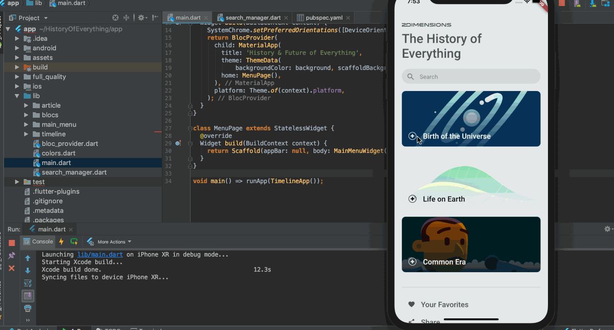
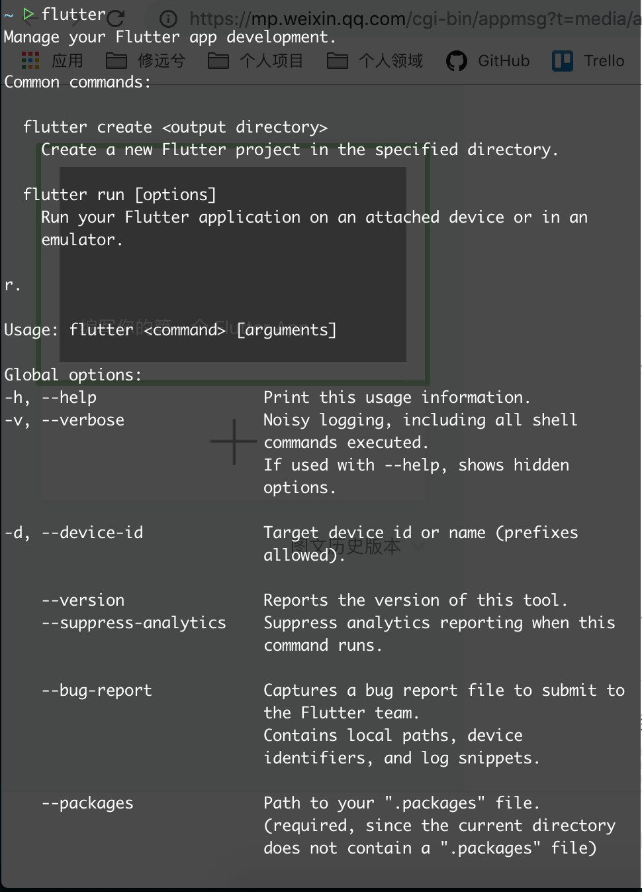
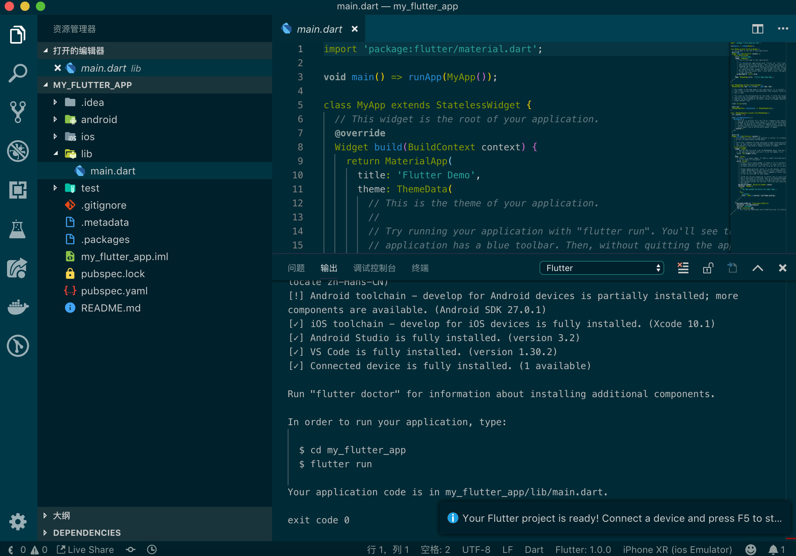
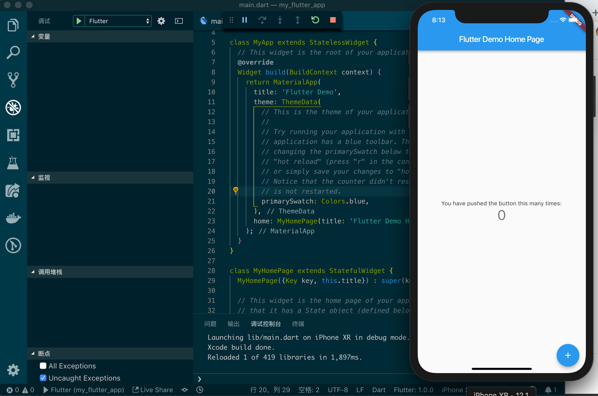
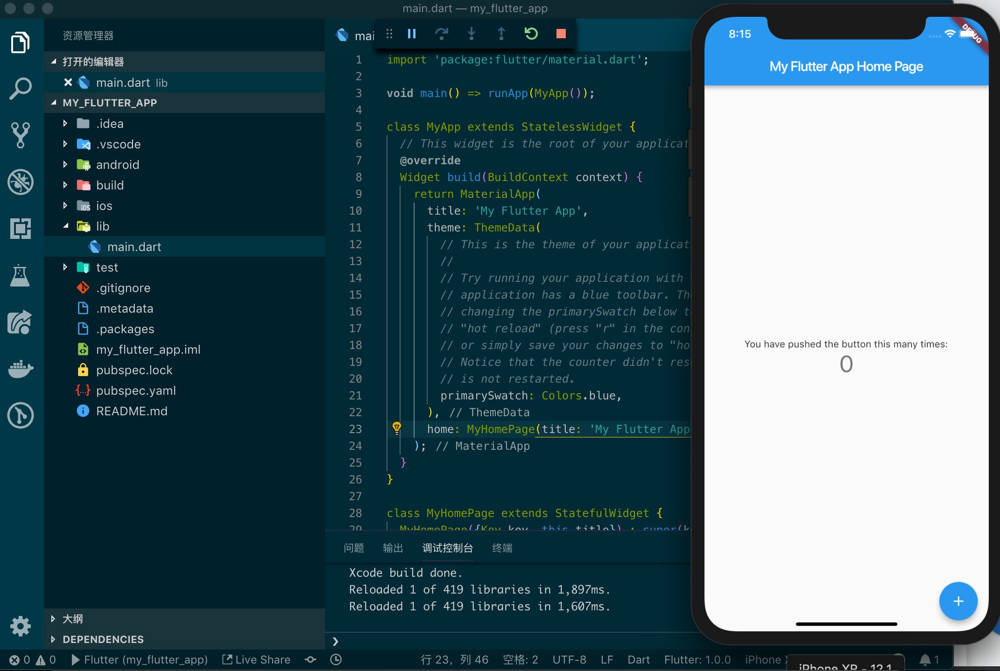
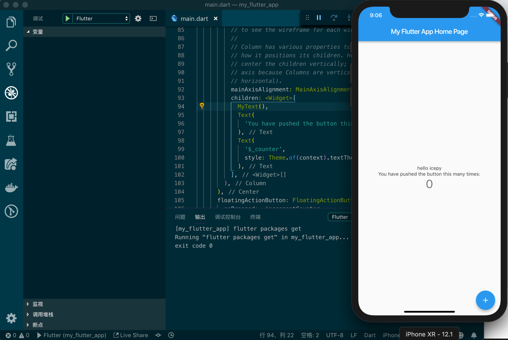

## 编写你的第一个 Flutter App

Flutter 是 Google 用以帮助开发者在 iOS 和 Andorid 两个平台开发高质量 UI 的移动 SDK，免费且开源。为了体验 Flutter 编写的 App，我将它的示例应用编译了起来，UI处理确实很细腻入微，沉浸式的体验过之后，发觉到值得我们深入去学习。

示例项目地址：[https://github.com/2d-inc/HistoryOfEverything](https://github.com/2d-inc/HistoryOfEverything)



既然是编写你的第一个 Flutter App，本文仅仅从入门的角度而言，它需要你准备一些很入门的工作，如下：

- 能访问 Google 资源的网络
- 安装 Xcode，因为我们需要 iOS 模拟器
- 正确的安装 Flutter SDK
- 安装 VSCode 和 Flutter 插件

在你的bash 中配置：export PATH="$HOME/flutter/bin:$PATH"，在终端运行 flutter 是否有如下图所示



我们将使用 VSCode 创建一个简单的基于模板的 Flutter 工程，然后我们将项目命名为 my_flutter_app，使用 command + shift + p 唤起 VSCode 控制台，选择 Flutter: New Project ，输入 my_flutter_app 然后按下回车，等待如图：



在控制台中选择 Flutter 的配置，然后启动调试，最终的结果如图：



让我们从示例代码中修改几个字看看，将 Flutter Demo 修改为 My Flutter App，Flutter Demo Home Page 修改为 My Flutter App Home Page ，如图：



对于一个健全的 App ，我们可能会依赖官方或第三方成熟的包来开发我们的应用，对于 Flutter 而言它的包管理工具和 Node.js 的 package.json 类似，在 pubspec.yaml 中你可以添加一个第三方包，一旦你保存了 pubspec.yaml 文件，VSCode 会自动的帮你下载，安装这个 Flutter Package ，因此它需要你的环境可以正常的访问 Google 的资源，这很重要。当然如果你不想 VSCode 自动下载安装，也可以在你的工程目录中，输入：flutter package get 来完成安装的进度；

接下来，让我们在示例项目中添加一个输出 hello icepy ，创建一个简单的文本 StatelessWidget ，用于显示 hello icepy，并把它添加到 _MyHomePageState 中。

```dart
class MyText extends StatelessWidget {

  @override
  Widget build(BuildContext context){
    return (
      Text(
        'hello icepy'
      )
    );
  }
}
```



它看起来会是这样的，hello icepy 居中在原 Text 的上方，这是因为我将 MyText 添加在了 children 的第一个元素位置，它被 Center 和 Column 包裹着，必然如此。如果你能阅读到此处，那么恭喜你，这将是你编写的第一个 Flutter App，为你的ID添加了一个 hello ，这很有趣。