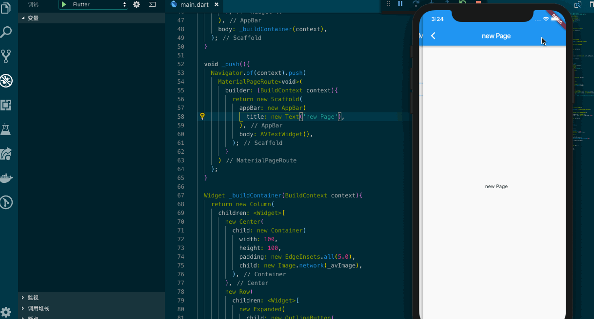

## 你不可避免的 Flutter Routes

如果你开发过单页应用并且使用过 react-dom-router ，那么对于一个 Web App 来说通过路由跳转到一个新的页面对于你的业务来说有多么重要。在 Flutter 里路由的切换也同等重要，相应的 Flutter 的导航器管理着应用程序的路由栈，将页面 push 到导航器中或 pop 出导航器，这一点上非常类似 react-dom-router 提供的功能；

在这一篇文章里，我们将学习到如何为 AVUpdateState 添加一个 _push 方法和导航器；



为此我们先定义一个 Stateless AVTextWidget ，它只是显示一个 new Page 的文本，并且是垂直居中的。

```dart
class AVTextWidget extends StatelessWidget {
  @override
  Widget build(BuildContext context) {
    return new Scaffold(
      appBar: new AppBar(
        title: new Text('new Page'),
      ),
      body: new Center(
        child: new Text(
          'new Page'
        ),
      )
    );
  }
}
```

在 AVUpdateState 中定义一个 _push 方法，并且在 appBar 中添加一个稍微好看一些的按钮，我选择的是 `Icons.account_balance` ，在 onPressed 中调用我们已经定义的 _push 方法。_push 方法中我们会使用到 Navigator 和 MaterialPageRoute ，当用户点击那个 icon 时我们会创建一个路由并将其 push 到导航管理器栈中。

```dart
Navigator.of(context).push(
  MaterialPageRoute<void>(
    builder: (BuildContext context){
      return AVTextWidget();
    }
  )
);
```

为了让它看起来像一个 App 的页面，在 builder 中 我直接返回了一个 Scaffold 并且定义了一个 appBar 显示 new Page。相应的，我们也可以使用 Navigator.of(context).pop 来返回上一个页面。

不过，这样的路由看起来还非常的简陋，想象一下当我们使用 React 时路由的跳转可以很方便的利用命名来完成，在 Flutter 里，我们也可以完成这样的映射关系，只不过我们需要在 MaterialApp 中完成。

```dart
class MyApp extends StatelessWidget {
  @override
  Widget build(BuildContext context) {
    return new MaterialApp(
      title: 'Welcome to Flutter',
      home: new AVUpdate(),
      routes: <String, WidgetBuilder> {
        '/push': (BuildContext context) => AVTextWidget(),
      },
    );
  }
}
```

修改 _push 方法中的逻辑

```dart
Navigator.of(context).pushNamed('/push');
```

当你阅读到此处，恭喜你开始具备开发多页面的能力了；