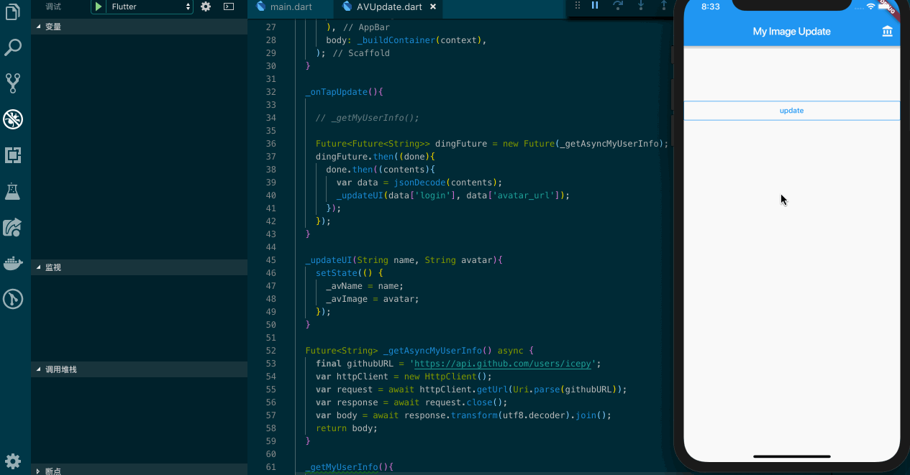

## 谈谈 Flutter 中的请求和异步

如果你了解过 JavaScript 的线程模型，那么就会明白当你遇到有延迟的运算时（请求），它的运行过程都是异步的，只有这样你的 Web 应用UI才不会出现明显的卡顿。在现实的网络世界里，多数情况下我们的业务都基于请求而展开的，Dart也是一个单线程的语言，因此在操作请求时它的运行过程也是异步，Dart.io 中封装了操作请求的类，你可以很便捷的使用它们。

让我们来看一个例子，请求 [https://api.github.com/users/icepy](https://api.github.com/users/icepy)，然后更新UI：



```dart
import 'dart:io';
var httpClient = new HttpClient();

...doing
```

这篇文章会用前端的视角来描述一下关于在 Flutter 中如何处理异步的问题。上述例子中，我写了两种方式来操作请求，并更新界面；如果你是前端那么一定了解 Promise 和 axios，Promise 是前端处理异步所有方案的基石。

```javascript
const axios = require('axios');
axios.get('/user?ID=12345')
  .then(function (response) {
    // handle success
    console.log(response);
  })
  .catch(function (error) {
    // handle error
    console.log(error);
  })
  .then(function () {
    // always executed
  });
```

那么让我们来看一看 Dart 版的异步请求：

```dart
final githubURL = 'https://api.github.com/users/icepy';
var httpClient = new HttpClient();
String jsonStr = '';
httpClient.getUrl(Uri.parse(githubURL)).then((HttpClientRequest request){
  return request.close();
}).then((HttpClientResponse response){
  response.transform(utf8.decoder).listen((contents){
    jsonStr += contents;
  }).onDone(() {
    // jsonStr
  });
});
```

是不是有一种和 Promise 非常类似的感觉？其实 getUrl 返回的是一个 Future<HttpClientRequest>，你可以把它理解为前端的 Promise。只不过在 Dart 的世界里 Future 是它来表示异步操作的的方式，**事件循环**和**线程队列**真是一个很神奇的设计，我们又遇到了它。

那么，我们还有没有更直观的方案来处理异步操作？

对于前端的同学都非常了解 async 和 await 特性，在 Dart 的世界里也有 async 和 await，我们可以通过这些关键字的标记来处理异步请求。

```dart
Future<String> _getAsyncMyUserInfo() async {
  final githubURL = 'https://api.github.com/users/icepy';
  var httpClient = new HttpClient();
  var request = await httpClient.getUrl(Uri.parse(githubURL));
  var response = await request.close();
  var body = await response.transform(utf8.decoder).join();
  return body;
}
```

其实它返回的也是一个 Future，只不过对于 Dart 处理 async await 有它自己的定义，总结下来就是两条：

- await 必须在 async 函数里执行
- 要执行 async 函数必须用 await 关键字

在我们上述的 Widget 中我们没法把 builder 标记为 async ，这其实就比较纠结了，如果要从根上能运行 async 定义的函数或方法，我们还是需要借助 Future 来完成。

```dart

Future<Future<String>> dingFuture = new Future(_getAsyncMyUserInfo);

dingFuture.then((done){
  done.then((contents){
    var data = jsonDecode(contents);
    _updateUI(data['login'], data['avatar_url']);
  });
});
```

当然 async await 和 Future 的结合有很多种玩法，因此 Future 对于开发者来说是必须要掌握的一个特性，就像前端的同学必须掌握 Promise 一样，当你对它的原理足够理解，你就会明白，向 event queue 插入你的 event handler 是多么的重要，它将贯彻你开发 Flutter 应用的全部过程。

在我们真实的业务场景中多数情况下不会使用这么低级的API去处理请求，要么封装要么使用开源库，Dart Team 官方提供了一个 http package [https://pub.dartlang.org/packages/http](https://pub.dartlang.org/packages/http)，来让我们更方便的开发业务。

```dart
import 'package:http/http.dart' as http;

var url = "http://example.com/whatsit/create";
http.post(url, body: {"name": "doodle", "color": "blue"})
    .then((response) {
  print("Response status: ${response.statusCode}");
  print("Response body: ${response.body}");
});

http.read("http://example.com/foobar.txt").then(print);
```