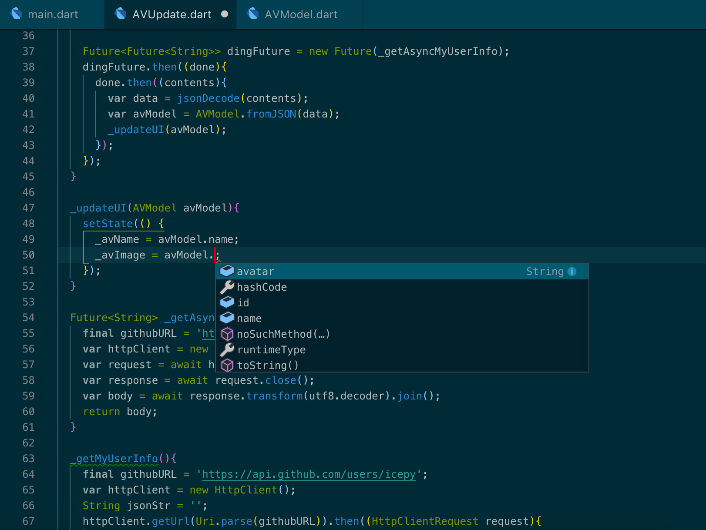

## 对 Flutter JSON序列化的一些理解

在没有类型检查的语言（JavaScript）中，当你需要从 [https://api.github.com/users/icepy](https://api.github.com/users/icepy) 获取数据来更新UI时，最大的可能也就是 JSON.parse 一下，然后直接 data['login'] 来使用，这并不是一个很好的注意。当你开始使用 TypeScript 时，也许你会：

```javascript
interface IResult {
  login: string;
  id: number;
  node_id: string;
  avatar_url: string;
}

interface IResponse<T> {
  data: T
}
```

定义这样的接口来描述你将使用的字段名，这会是一个很好的开始。

在 Flutter 的世界里你也可以很简单的去 parse 一下然后使用这些数据，导入 dart:convert即可，在一个简单的例子中我们来展示该如何使用：

```dart
import 'dart:convert';

Map<String, dynamic> user = jsonDecode(jsonString);

user['login']
user['id']
```

不过，我们可以将它改造的更有用一些，如果你了解过传统的 MVC 模型，那么你就知道定义一个 Model 会非常有用。让我们接上一个例子，写一个 AVModel 类然后稍微改造一下：

```dart
class AVModel {
  final String name;
  final int id;
  final String avatar;

  AVModel(this.name, this.id, this.avatar);

  AVModel.fromJSON(Map<String, dynamic> json)
         :id = json['id'],
         name = json['login'],
         avatar = json['avatar_url'];
}
```

```dart
Future<Future<String>> dingFuture = new Future(_getAsyncMyUserInfo);
dingFuture.then((done){
  done.then((contents){
    var data = jsonDecode(contents);
    var avModel = AVModel.fromJSON(data);
    _updateUI(avModel);
  });
});

_updateUI(AVModel avModel){
  setState(() {
    _avName = avModel.name;
    _avImage = avModel.avatar;
  });
}
```



和请求模块一样，Dart Team官方也提供了一个封装程度较高的 package [https://pub.dartlang.org/packages/json_annotation](https://pub.dartlang.org/packages/json_annotation)。

序列化和反序列化多数的方案都是为了方便管理业务数据而生的，Dart 团队和社区在这方面讨论诸多，我们只需要借鉴和思考哪些方案是适合现阶段的业务，哪些方案是未来可以升级改造的，有时候过度的优化，反而对实现有了太强的约束，合适真的很重要。