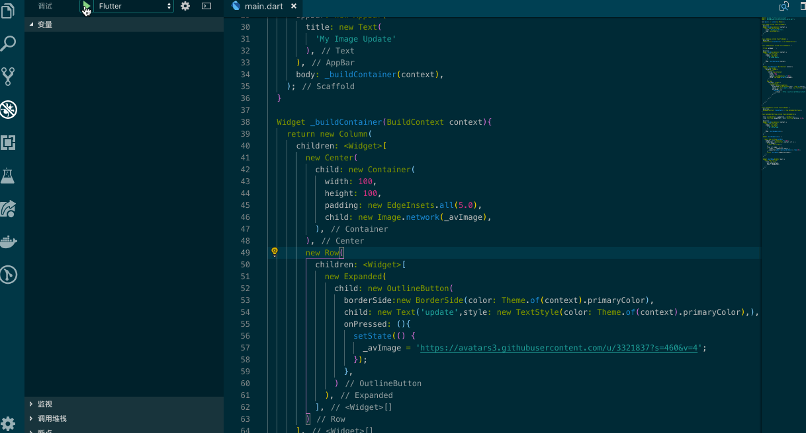

## 编写你的第一个 StatefulWidget

前面一篇文章描写了一个打印hello的StatelessWidget的封装，接下来我们应该了解该如何封装一个简单的StatefulWidget，来驱动一次交互，这个交互的过程，会执行一次onPressed来更新一个image头像。我用一个这样的例子，想描述出来，我们该如何在应用中，完成自己的StatefulWidget设计。



让我们先来定义一个AVUpdateState 和 AVUpdate ，绘制一个垂直居中的图片和按钮，_avImage变量来接收从网络获取的图片，setState这个_avImage 来更新UI。如果你对 React 很熟悉，那么这个过程和调用 React setState 非常的像。

```dart
class AVUpdate extends StatefulWidget {
  @override
  AVUpdateState createState() => new AVUpdateState();
}

class AVUpdateState extends State<AVUpdate> {};
```

定义 _avImage，它是一个 String 类型；不过，我们应该让它看起来是一个App，给它一个appBar并且赋值一个标题 My Update Image。

```dart
class AVUpdateState extends State<AVUpdate> {
  String _avImage = '';

  @override
  Widget build(BuildContext context) {
    return new Scaffold(
      appBar: new AppBar(
        title: new Text(
          'My Image Update'
        ),
      )
    );
  }
};
```

接下来，我们定义一个私有的Widget _buildContainer ，在这个 Widget 中，我们要使用 Center 让图片居中，OutlineButton 来将 update 按钮显示出来，并且给它一些样式，最后将 _buildContainer 赋值给 body，就如：

```dart
class AVUpdateState extends State<AVUpdate> {

  String _avImage = '';

  @override
  Widget build(BuildContext context) {
    return new Scaffold(
      appBar: new AppBar(
        title: new Text(
          'My Image Update'
        ),
      ),
      body: _buildContainer(context),
    );
  }

  Widget _buildContainer(BuildContext context){
    return new Column(
      children: <Widget>[
        new Center(
          child: new Container(
            width: 100,
            height: 100,
            padding: new EdgeInsets.all(5.0),
            child: new Image.network(_avImage),
          ),
        ),
        new Row(
          children: <Widget>[
            new Expanded(
              child: new OutlineButton(
                borderSide:new BorderSide(color: Theme.of(context).primaryColor),
                child: new Text('update',style: new TextStyle(color: Theme.of(context).primaryColor),),
                onPressed: (){
                  //
                },
              )
            ),
          ],
        )
      ],
    );
  }
}
```

最后，在 onPressed 中调用 setState 方法来更新UI；

```dart
setState(() {
  _avImage = 'https://avatars3.githubusercontent.com/u/3321837?s=460&v=4';           
});
```

Flutter 定义的 Image 可以获取四种资源，由于这里我们是从网络中获取，因此很便捷的就使用了 Image.network 来展示图片。