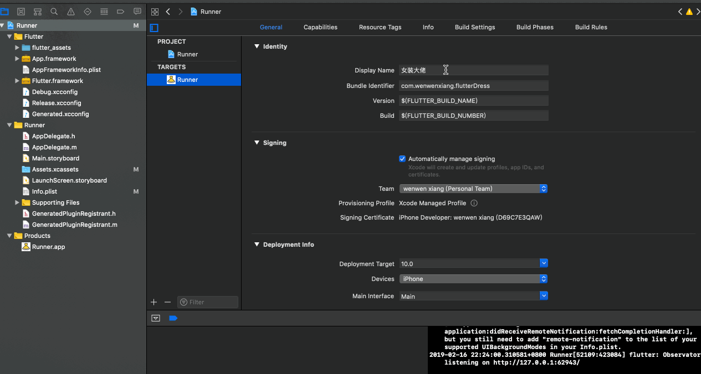
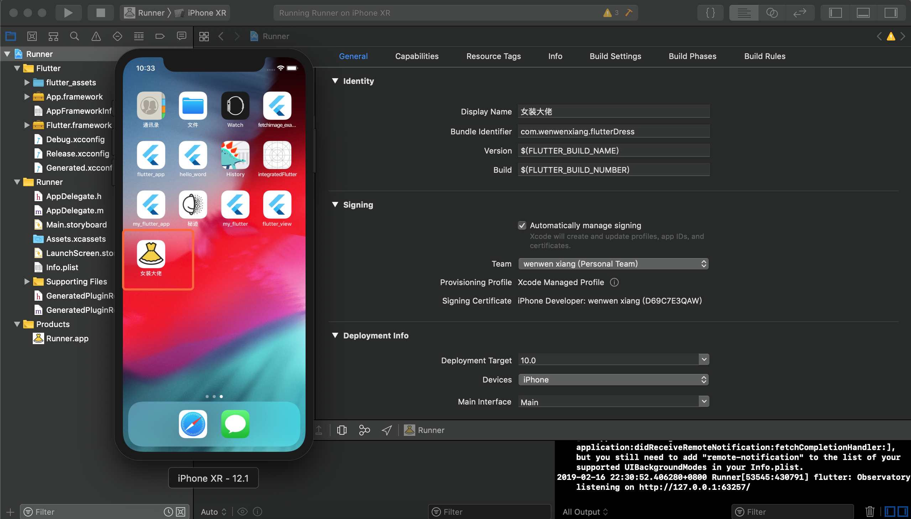

## 将 Flutter 应用发布到 iOS 平台

> 默认你已经准备好了 Apple 开发者账户，并且已经在 App Store Connect 中创建了你的应用。

当你开发完成你的应用时，此刻要么将它发布在测试网络提供给你的朋友们去测试，要么发布到 App Store 让广大人民群众下载安装，在此之前你可能还需要做一些准备工作，考虑到未来我们会做一个演示应用，因此就直接使用它来做演示了，我也做一张 gif 动画让大家查看：

在 ios 目录下打开 Runner.xcworkspace，基本上你需要改动的地方可能有：

- Display Name 也就是你的应用名称
- Bundle identifier 唯一的 bundle ID
- Signing 部分应该选择你的发布证书
- Deployment Info 中你可以选择的有支持的系统版本，仅iPhone吗等等一系列的选项
- 在 Assets.xcassets 中更换你应用的图标

然后 Run 起来，你即将得到如下图的效果：

最后如果你想发布到 App Store 可以在菜单栏上的 Product -> Archive 做一份构建，选择你要发布的版本最后点击下一步即可，这一个过程 Xcode 会自动帮你完成。