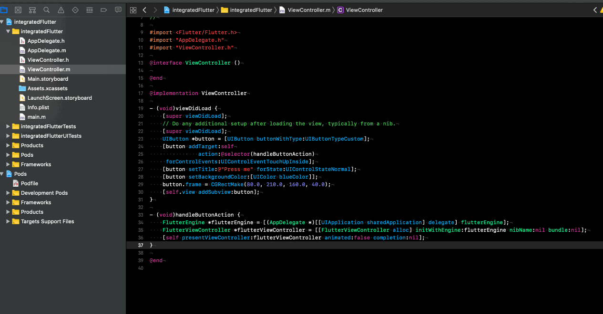

## 将 Flutter 集成到已有的iOS工程中



我可能需要做一个假设你已有的iOS工程路径在 ~/integratedFlutter 目录中，你需要在这个目录里创建 Flutter 的模块：

```bash
$ cd ~/integratedFlutter
$ flutter create -t module my_flutter
```

在 my_flutter 目录中 flutter 会创建一些 Dart 代码，一些 Ruby脚本，启动项以及一个隐藏的.ios子目录。

接着在你的 Podfile 文件中添加 Flutter 提供好的脚本：

```bash
platform :ios, '8.0'

target 'integratedFlutter' do
  flutter_application_path = '/Users/xiangwenwen/integratedFlutter/my_flutter/'
  eval(File.read(File.join(flutter_application_path, '.ios', 'Flutter', 'podhelper.rb')), binding)
end
```

其实这一行脚本会从.ios目录中安装 Flutter 的引擎。

```bash
$ pod install
```

等待安装完成。

使用 Xcode 打开 integratedFlutter.xcworkspace，在 Build Phases 中创建一个新的 Script Phases ，将如下两行粘贴到 Shell 中：

```bash
"$FLUTTER_ROOT/packages/flutter_tools/bin/xcode_backend.sh" build
"$FLUTTER_ROOT/packages/flutter_tools/bin/xcode_backend.sh" embed
```

最后将 Build Settings -> Build Options -> Enable Bitcode 设置为 No，运行 command + b 编译工程，至此工程的配置就已经完成了，接下来需要在代码中将 Flutter 的引擎使用起来。

打开你的 AppDelegate.h ，修改如下：

```Objective-C
#import <UIKit/UIKit.h>
#import <Flutter/Flutter.h>

@interface AppDelegate : FlutterAppDelegate

@property (nonatomic,strong) FlutterEngine *flutterEngine;

@end
```

AppDelegate.m 文件，修改如下：

```Objective-C
#import <FlutterPluginRegistrant/GeneratedPluginRegistrant.h>

@implementation AppDelegate

- (BOOL)application:(UIApplication *)application didFinishLaunchingWithOptions:(NSDictionary *)launchOptions {
    // Override point for customization after application launch.
    self.flutterEngine = [[FlutterEngine alloc] initWithName:@"io.flutter" project:nil];
    [self.flutterEngine runWithEntrypoint:nil];
    [GeneratedPluginRegistrant registerWithRegistry:self.flutterEngine];
    return [super application:application didFinishLaunchingWithOptions:launchOptions];
}

@end
```

GeneratedPluginRegistrant 是用于你添加了 Flutter 的插件；

接着，我们来定义一个 ViewController，将 FlutterViewController 添加进去：

```Objective-C

#import <Flutter/Flutter.h>
#import "AppDelegate.h"
#import "ViewController.h"

@interface ViewController ()

@end

@implementation ViewController

- (void)viewDidLoad {
    [super viewDidLoad];
    // Do any additional setup after loading the view, typically from a nib.
    [super viewDidLoad];
    UIButton *button = [UIButton buttonWithType:UIButtonTypeCustom];
    [button addTarget:self
               action:@selector(handleButtonAction)
     forControlEvents:UIControlEventTouchUpInside];
    [button setTitle:@"Press me" forState:UIControlStateNormal];
    [button setBackgroundColor:[UIColor blueColor]];
    button.frame = CGRectMake(80.0, 210.0, 160.0, 40.0);
    [self.view addSubview:button];
}

- (void)handleButtonAction {
    FlutterEngine *flutterEngine = [(AppDelegate *)[[UIApplication sharedApplication] delegate] flutterEngine];
    FlutterViewController *flutterViewController = [[FlutterViewController alloc] initWithEngine:flutterEngine nibName:nil bundle:nil];
    [self presentViewController:flutterViewController animated:false completion:nil];
}

@end
```

现在我们可以进入之前创建的my_flutter目录运行：

```bash
$ cd ~/my_flutter
$ flutter attach
```

最后在 Xcode 中 command + R 将工程重新跑起来。