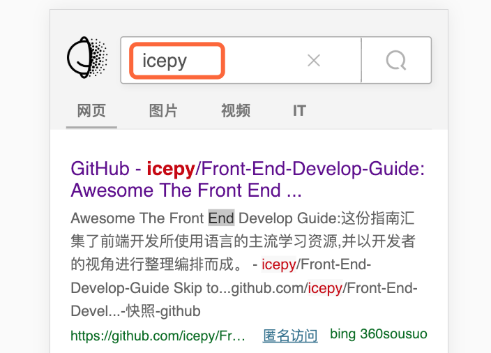

抛开语言不谈，对于想快速开发的同学来说，我把 Flutter 最核心的业务要素提炼成了三个部分，它们分别是 布局 ，交互，和 bridge，当我们比较注重更细节的组合时，你的应用会更细腻入微而已，在此之前它们会是贯穿你学习周期的全部；

## 布局


如果有一个这样的经典排版，在 Flutter 中存在四种布局模型，当我们拿到这样一个页面时，我们该如何分布？蓝色的代表一个 Row ，也就是横向排列，每一张图片都有等比的间距，因此红色区域代表了一个 Container 来绘制边距，整体的蓝色外部还有一个竖向排列的 Column 。


那么再让我们分解一下nav的布局排列，一组四个文字的 Row （黄色），一个绿色的 Container 包含之间的间距，一个橘红色的文字和_ 竖向排列，一个 Column。我们可以把它理解为一个弹性布局的模型，我们通过这些排列的方式来完成布局，更细节的问题，也可以依次展开；在 Flutter 中有一套丰富的 widget 来完成布局，通过不同的组合使用，能达到你的预期。这是一种布局设计的方式，除了弹性布局之外，还有绝对定位式的布局，如：


Stack 是一种绝对布局的widget，利用它可以叠加到其他的widget上，来达到你想要的目的。那么其实，这些widget有很多布局的约束，如Center等等。你可以想象一下，任何函数都会有一个入口RUN，Flutter也不例外，当我们将这些元素视为一颗树时，我们就能明白，其实当我们在绘制UI时要更多的考虑，如何用代码去完成这颗树，想象一下，当我们完成一个 transform ，利用 React 来描述 UI，最终生成一颗 Flutter 的UI层级，这也不是问题；

## 交互

几乎目前大部分绘制UI交互的设计，都有一种数据驱动的逻辑，框架在接收到数据的变更时，会启动一次diff的比对，将变动的UI进行重新绘制，一个很简单的例子，如：



当你在Input框中输入一个文本，它的逻辑可能如下：

```javascript
inputValue = "";

onChange(e){
  setState({
    inputValue: e.target.value
  });
}
```

当然这也意味着，在你设计你的应用交互时，需要着重的考虑，你的state会有哪些属性，这些属性在变更时会触发Flutter的updater来绘制UI，这个过程非常类似 React 中的 diff 以及  setState 方法；当然大部分的时候交互是一种人机的互动，有事件，有手势，这一部分很有趣的设计是，大部分需要你和stateful来结合设计，当你为一个图层监听上了一个onTap事件时，通过state 的驱动，来完成 UI 的绘制；GestureDetector它也是一个widget ，我们可以使用它来完成手势；

## bridge

不管是任何一个混合开发的解决方案，基本上都是在UI层面去完成跨平台，一次开发运行多处，但是当你需要完成特定的功能时，比如：打开相册获取照片，这在这一层面上就无法撼动了，你依然需要使用 Native 的方式来完成，唯一不同的时，通信的设计为这样的交互带来了便利，我们统称为 bridge ，在这样的模式中，我们可以为各种特定的平台来完成特定的功能；

```javascript
{
  id: "xxx",
  module: "query"
  method: "findP",
  callbackId: "xxxxxxxx"
}
```

大体上你会设计一个这样的通信协议，module 是你定义的模块名称，method 是你要执行的方法，callbackId 是你已经在 native 层面注册的可交互的 函数id，这个id用于最后交互时找到这个函数，并把数据提交给混合开发的 UI 层面。Flutter 也设计了这样一套通信的bridge ，开放了接口，让native的某些功能可以特定的实现，多数情况我们仅仅只需要一丢丢；