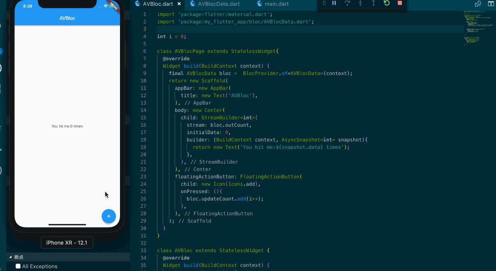
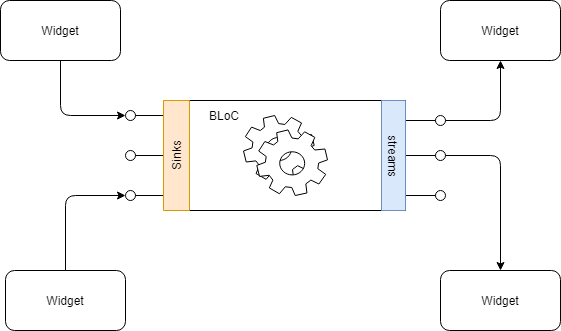

## 在 Flutter 中使用 Bloc 来处理数据并更新 UI

这是一种设计模式，由 paolo soares 和 cong hui 在2018年Google dartconf上提出，具体可参看 [https://www.youtube.com/watch?v=PLHln7wHgPE](https://www.youtube.com/watch?v=PLHln7wHgPE)，Bloc 是英文 Business Logic Component 的缩写，基本从字面的意思上来看，它是一种面向组件和业务逻辑的分离的优雅策略，通常我习惯性的将设计模式称之为一种策略。

且让我们看一个效果图：



上图的例子已经用 Bloc 模式重写，且让我们从一张图中了解一下，这种设计模式的特点：



我们可以把 Bloc 做为一个管道，在这个管道中流（数据）的驱动方式为我们生动的展示了分离的策略。那么相比之下复杂的业务逻辑中应用 Bloc 我们能得到多少收益？

- 业务逻辑和 Widget 的分离
- 可单独测试业务逻辑
- 可更好的重用业务逻辑代码

Bloc 侧重于利用 Stream 来设计符合上述策略的代码，数据从 Bloc 而来，从 Stream 而出，最后落地到更新 Widget 上。既然提到了 Stream ，那么让我们来设计一个最小的 Bloc 来完成这个设计。

先定义一个抽象类：

```dart
abstract class BlocBase{
  void dispose();
}
```

dispose 方法可用于 Widget 释放时能关闭 Stream。

然后我们需要设计一个 BlocProvider StatefulWidget 来处理数据，它接收两个参数：

- bloc 对象
- child 子 Widget

```dart
class BlocProvider<T extends BlocBase> extends StatefulWidget{
  
  final T bloc;
  final Widget child;

  BlocProvider({
    Key key,
    @required this.child,
    @required this.bloc,
  }) : super(key: key);

  @override
  _BlocProviderState<T> createState() => new _BlocProviderState<T>();

  static Type _typeOf<T>() => T;

  static T of<T extends BlocBase>(BuildContext context){
    final type = _typeOf<BlocProvider<T>>();
    BlocProvider<T> provider = context.ancestorWidgetOfExactType(type);
    return provider.bloc;
  }
}

class _BlocProviderState<T> extends State<BlocProvider<BlocBase>>{
  @override
  void dispose(){
    widget.bloc.dispose();
    super.dispose();
  }

  @override
  Widget build(BuildContext context) {
    return widget.child;
  }
}
```

作为一个很抽象的入口，其实我们并不知道传入的类型是什么，因此我们需要借助范型来完成对类型的限定。在 State 中实现 dispose 方法用于将来实现关闭 Stream。

在我们重点需要关注的地方是对于出口和入口（Stream），我们应该初始化两个 StreamController 来控制这样的情况，利用 sink 来添加数据，利用 stream 来将数据从出口流出。在我们的那个例子里，为了能点击按钮自增，因此我利用了 outCount 来代表出口，updateCount 来代表入口：

```dart
class AVBlocData implements BlocBase {
  int _count;

  StreamController<int> _countController = new StreamController();
  StreamSink<int> get _inadd => _countController.sink;
  Stream<int> get outCount => _countController.stream;

  StreamController _actionController = new StreamController();
  StreamSink get updateCount => _actionController.sink;

  AVBlocData(){
    _count = 0;
    _actionController.stream.listen(_handleLogic);
  }

  void _handleLogic(data){
    _count = data + 1;
    _inadd.add(_count);
  }

  void dispose(){
    _countController.close();
    _actionController.close();
  }
}
```

写到这里我们设计的 Bloc 类就基本成型了，但对于更新 Widget 来说它还少了一些东西，这个东西是如何将 Widget 与 Stream bind在一起的 Widget，我们会用 StreamBuilder 来完成它。

```dart
import 'package:flutter/material.dart';
import 'package:my_flutter_app/bloc/AVBlocData.dart';

int i = 0;

class AVBlocPage extends StatelessWidget{
  @override
  Widget build(BuildContext context) {
    final AVBlocData bloc =  BlocProvider.of<AVBlocData>(context);
    return new Scaffold(
      appBar: new AppBar(
        title: new Text('AVBloc'),
      ),
      body: new Center(
        child: StreamBuilder<int>(
          stream: bloc.outCount,
          initialData: 0,
          builder: (BuildContext context, AsyncSnapshot<int> snapshot){
            return new Text('You hit me:${snapshot.data} times');
          },
        ),
      ),
      floatingActionButton: FloatingActionButton(
        child: new Icon(Icons.add),
        onPressed: (){
          bloc.updateCount.add(i++);
        },
      ),
    );
  }
}

class AVBloc extends StatelessWidget {
  @override
  Widget build(BuildContext context) {
    return new MaterialApp(
      home: BlocProvider<AVBlocData>(
        bloc: new AVBlocData(),
        child: AVBlocPage()
      ),
    );
  }
}
```

在整个 Bloc 的设计中，其实你能看见就是利用了 StreamController 和 StreamBuilder 来完成 Widget 的更新，但不过 Bloc 让你的设计可以从 Widget 中分离到别的文件，这种抽离为你的业务逻辑自动化测试做好了准备。

那么对于 Bloc 实例来说它的传递方式可以有多种多样，最常见如上述的例子从父 Widget 而来，我们也可以利用 State 的 dispose 来关闭 Stream。其实我还可以利用前端 React Context 举一个一摸一样的例子，你完全可以将它看为只是一种 React Context 的实现（如果很难理解的话）。