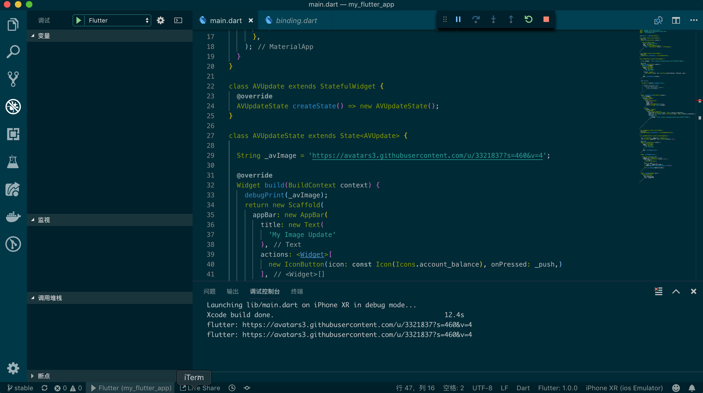
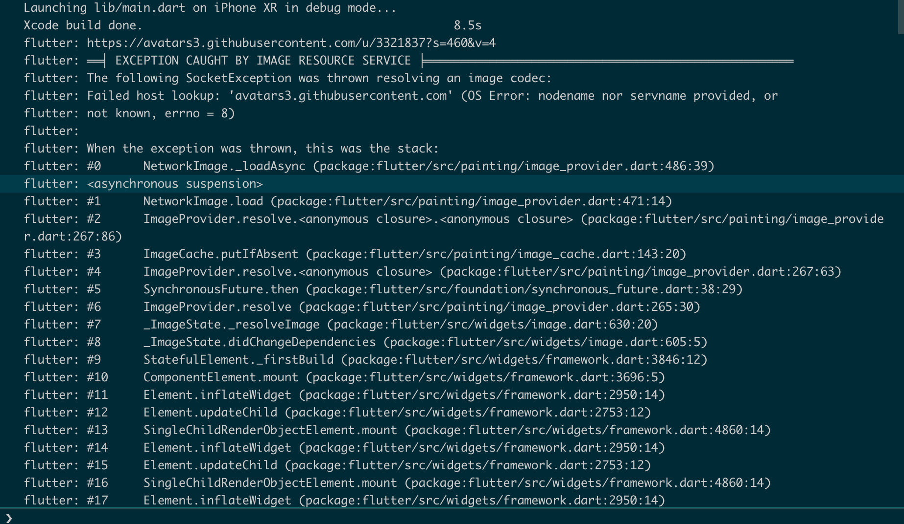
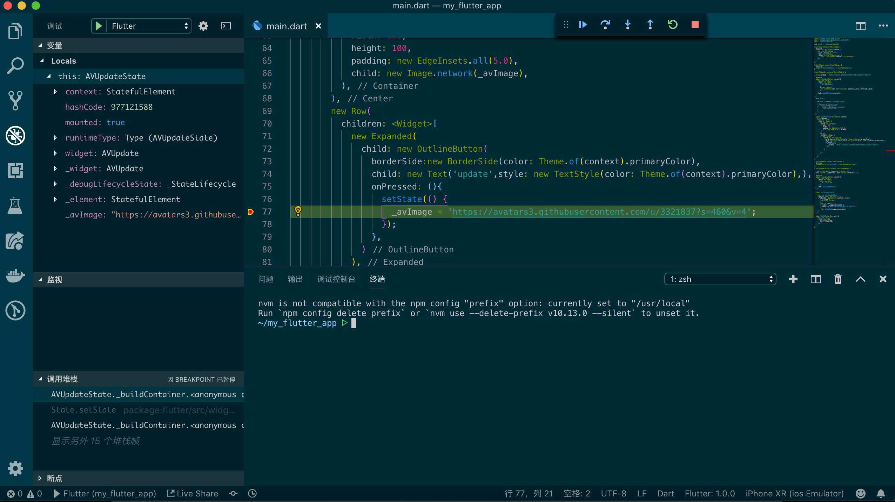
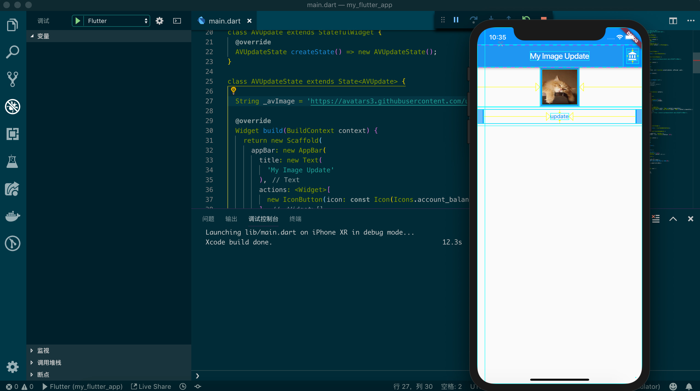
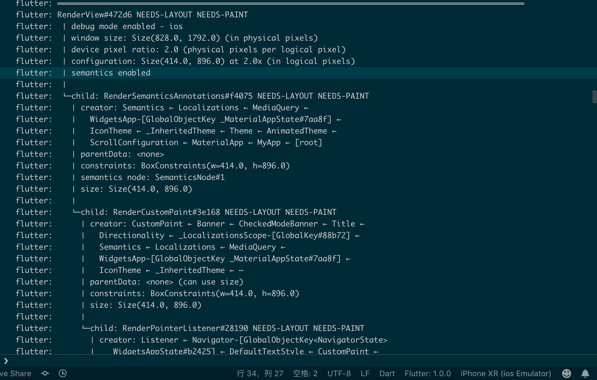
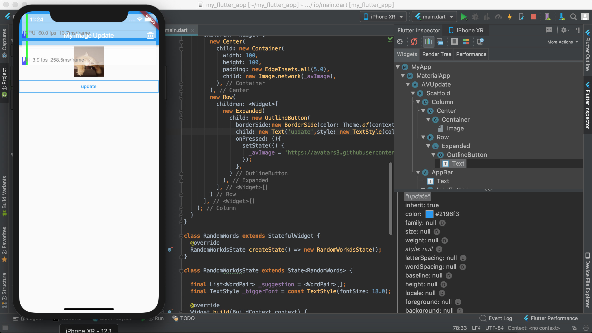

## Flutter 调试技巧

对于前端的同学在调试时我们有很多方式可以用，比如 Chrome Dev Tools ，你可以在 Elements 上调试布局和样式，也可以利用 console.log 来打印变量，当然也有较多的栈信息让你来判断错误和 debug，相应的 Flutter 也有很多调试技巧可以辅助我们更好的进行开发并解决问题。

当我们很难预估一个值时，最简单的方式是将这个值打印出来，通过控制台来查看输出的信息，由于我们使用了 Dart 来开发 Flutter ，因此我们可以使用 debugPrint 等同于 console.log 的方式来打印它。

不过这种方式在复杂的场景中就显得效率低下，并且有可能会打击你的信心。当然调试做为一个工程师必备的手段，我们应该用更高效的方式和工具来辅助我们，一旦你养成了良好的习惯，这些辅助也是你深入bug原因的起点，为你的职业生涯添加浓厚的一笔资产。

对于语法和入门级的错误，不管是 VSCode 还是 Android Studio 都会通过标红的方式反馈给你，你可以根据编辑器或IDE给出的经典信息来做判断，这一阶段的实践也会为你写代码的严谨带来较多的思考。但是，当你遇见运行时的错误时，这样的方式可能就有一些力不从心了，不过，我们有一些其他的技巧来辅助你完成这些判断。

第一种方式是通过错误堆栈来定位具体的错误，对于这样的错误 Flutter 一般会给予一些经典的错误信息，多数情况下，你都可以通过 Google 完成排除错误的过程。当然如果遇见了复杂的错误，这种定位的方式就像是阅读一层又一层的树，在这颗树中，我们可以从最起始的位置开始，当它发生在什么地方，假设这个被你定义了一个复杂的函数来处理数据，我们可以在代码中阅读这一段函数的逻辑，通过数据的对比，来查找一些可能的处理逻辑错误。

在这个错误中我们可以看见因为网络的问题抛出了一个 failed。

其次我们可以利用断点调试的功能，在VSCode的调试面板中，我们可以时时的查看变量的值，以及跟踪执行的步骤，在这个过程中，我们可以查看堆栈，也可以根据逻辑来做进一步的判断。

多数情况下我们使用 Flutter 是来绘制 UI，界面的调试在 debug 模式下其实没有什么用，但是我们可以利用 VSCode 的 Toggle Debug Painting 来启动界面调试工具，通过这些辅助线我们可以很方便的查阅到为什么布局和我们的预期有所不同。

当然在渲染层中，我们也可以通过debugDumpRenderTree()存渲染树，通过这颗树的仔细对比来定位问题，这些小小技巧多数情况下，是使用不上的。

不过，如果遇到很棘手的问题，多数情况下我会使用 Android Studio 来完成调试，因为它提供的功能和工具，比之 VSCode 不知道增强了多少，就比如调试界面，我们可以在 Android Studio 中启动 Flutter Inspector 能看到一个完整的层级以及我们可以自由的选中某一层级；

另外 Android Studio 中默认就安装了 Dart Analysis ，这个工具能辅助我们完成有问题代码的分析并且给出建议，当然VSCode中也有这样的功能，但是不知道为什么个人感觉Android Studio中提供的更完善和强大。如果你是Android 开发，在调试技巧这个层面上，我想你应该比前端开发人员拥有更多的优势，因为 Android Studio 做为你“吃饭”的家伙，肯定已经玩的很溜了。

说了这么多，调试最重要的还是细心和耐心，没有这两颗心，人一躁起来问题就很难解决了；