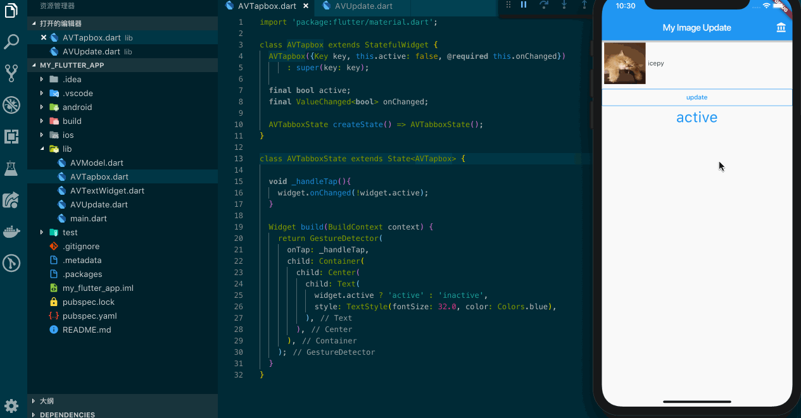

## 对于抽象 Widget 的意义

当我有一个 Widget 需要实现一些封装时，Flutter 官方推荐的设计其实和 React Props 非常像，并且你可以实现很早期的子 Widget 和 父 Widget 通信的过程，我想 mix 对于下一步我们抽象出自己的 Widget 封装并提交到仓库，让更多人使用你的 Widget，这会让你很有成就感。



基于 AV... 的例子，我设计了一个小的 Widget AVTapbox，它有两个属性 active 和 onChanged，在父 Widget 中将这两个属性所要求的类型传递给 AVTapbox。你能在这个例子中如图所视点击文字来让文字变化，并且通过父 Widget 来管理这个过程。

```dart
class AVTapbox extends StatefulWidget {
  AVTapbox({Key key, this.active: false, @required this.onChanged})
      : super(key: key);

  final bool active;
  final ValueChanged<bool> onChanged;

  AVTabboxState createState() => AVTabboxState();
}
```

```dart
class AVTabboxState extends State<AVTapbox> {
  
  void _handleTap(){
    widget.onChanged(!widget.active);
  }

  Widget build(BuildContext context) {
    return GestureDetector(
      onTap: _handleTap,
      child: Container(
        child: Center(
          child: Text(
            widget.active ? 'active' : 'inactive', 
            style: TextStyle(fontSize: 32.0, color: Colors.blue),
          ),
        ),
      ),
    );
  }
}
```

在这个例子中，我们可以通过 widget.onChanged 将参数传递给父 Widget。

在父 Widget 中我们同样需要设计一个属性和一个方法：

```dart
class AVUpdateState extends State<AVUpdate> { 
  bool _active = false;

  void _handleTapboxChanged(bool newValue) {
    setState(() {
      _active = newValue;
    });
  }
  ....
}
```

让我们来导入 AVTapbox 模块来看看如何使用它：

```dart
import 'package:my_flutter_app/AVTapbox.dart';

class AVUpdateState extends State<AVUpdate> { 
  ....
  Widget _buildAVTapbox(BuildContext context) {
    return new AVTapbox(
      active: _active,
      onChanged: _handleTapboxChanged,
    ),
  }
}
```

这样的封装对于不写 AVTapbox Widget 的开发者来说，他们只需要关心 active 和 onChanged。因为多数情况下，开发者并不关心 AVTapbox Widget 实现的细节，我们可以将它打包成一个 package 提供给依赖你的开发者。