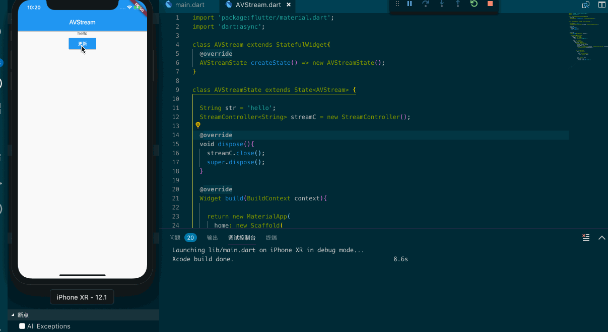

## 使用 Stream 来处理异步和简单更新 UI

很多其他的编程语言都有 Stream 的概念，dart 也未能免俗。如果你了解 Rx 系列，Stream 能让你在更新 UI 是避免使用 setState 方法，这也是处理异步除 Future 之外另一种很有趣的方式。在 Stream 的世界里你可以将它理解为一个管道，在管道的一边你会监听它，在管道的另一边你会往这个管道里去添加数据，管道监听的一边能收到你往这个管道里添加的数据，这种方式你也可以从观察者模式上去假设记忆般的理解，先让我们来看一个更新 UI 的例子，然后再让我们从头学习它。



对于 Stream 而言它有两种方式：

- 单订阅
- 广播 Stream

对于单订阅来说它只允许你实现一个监听的出口，你的第一个出口订阅一旦被取消，你将无法再次订阅。

```dart
StreamController<int> cr = new StreamController();
cr.stream.listen((data){
  debugPrint('${data}');
}); 

cr.sink.add(1);
cr.sink.add(2);
cr.sink.add(3);

cr.close();
```

从这个简单的例子来看，StreamController 使用 stream 来监听，使用 sink 来往这个管道里添加你提交的数据。

那么广播Stream又是什么？

广播 Stream 允许我们可以给 Stream 添加任意数量的订阅，一旦 Stream 开始工作，你添加的订阅都能接收到数据，一般情况下我们可以配合着 StreamTransformer 来使用，将 Stream 在通道里流转起来。

```dart
StreamController<int> cr2 = new StreamController();
final st = StreamTransformer<int, String>.fromHandlers(
  handleData: (int data, sink){
    if (data == 10) {
      sink.add('添加正常');
    } else {
      sink.addError('添加错误');
    }
  }
);

cr2.stream.transform(st).listen((String data){
  debugPrint(data);
}).onError((e){
  debugPrint('${e}');
});

cr2.sink.add(11);
cr2.sink.add(10);

cr2.close();
```

当然 Stream 也提供了很多便捷的构造方法供我们使用，我们并不需要如上那么麻烦的处理：

```dart
StreamController<int> cr3 = new StreamController();
cr3.stream.where((value){
  return value == 10;
}).listen((data){

});

cr3.sink.add(11);
cr3.sink.add(10);
cr3.close();
```

Stream 也是天然可以处理异步的，如果你不想使用 Future 那么利用 Stream 也能很好的处理异步。

### StreamBuilder

既然 Stream 这么好用那么在 Flutter 里我们要更新 UI 该如何处理？Flutter 提供了一个叫 StreamBuilder 的 Widget ，这个 Widget 就是专门将 Stream 和 Widget 关联起来，我们可以使用它很方便的来更新 UI，唯一需要注意的地方是，我们要在 dispose 中 close Stream。

```dart
StreamBuilder({
  Key key,
  this.initialData,
  Stream<T> stream,
  @required this.builder
})
```

StreamBuilder 的参数并不多，很容易让我们学习它，我们需要为它指定一个 stream 然后在 builder 中绘制 UI即可。


```dart
import 'package:flutter/material.dart';
import 'dart:async';

class AVStream extends StatefulWidget{
  @override
  AVStreamState createState() => new AVStreamState();
}

class AVStreamState extends State<AVStream> {

  String str = 'hello';
  StreamController<String> streamC = new StreamController();

  @override
  void dispose(){
    streamC.close();
    super.dispose();
  }

  @override
  Widget build(BuildContext context){

    return new MaterialApp(
      home: new Scaffold(
        appBar: new AppBar(
          title: new Text('AVStream'),
        ),
        body: new Center(
          child: new Column(
            children: <Widget>[
              StreamBuilder<String>(
                stream: streamC.stream,
                initialData: str,
                builder: (BuildContext context, AsyncSnapshot<String> snapshot){
                  return new Text(snapshot.data);
                },
              ),
              new RaisedButton(
                child: new Text(
                  '更新',
                  style: new TextStyle(
                    color: Colors.white
                  ),
                ),
                color: Colors.blue,
                onPressed: (){
                  streamC.sink.add('icepy');
                },
              )
            ],
          ),
        ),
      ),
    );
  }
}
```