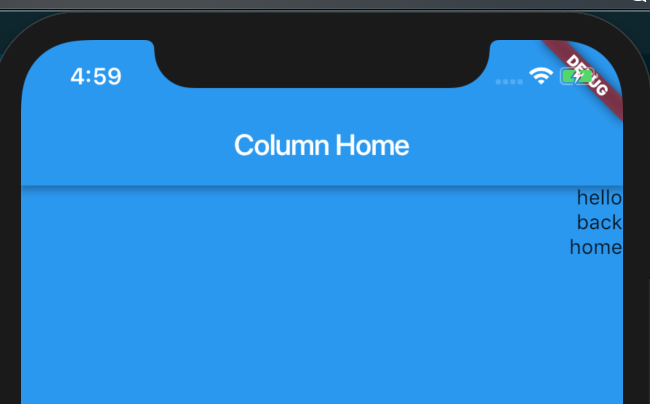
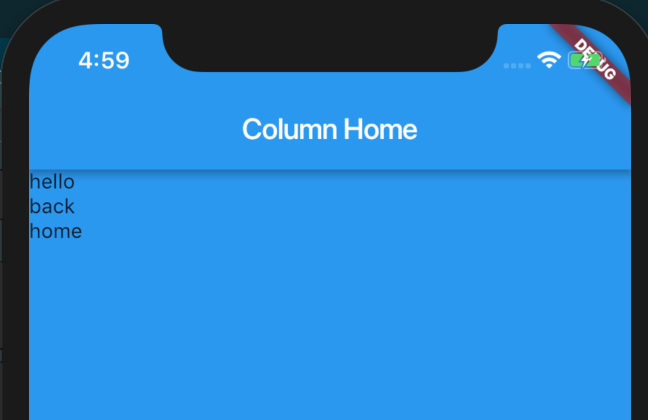
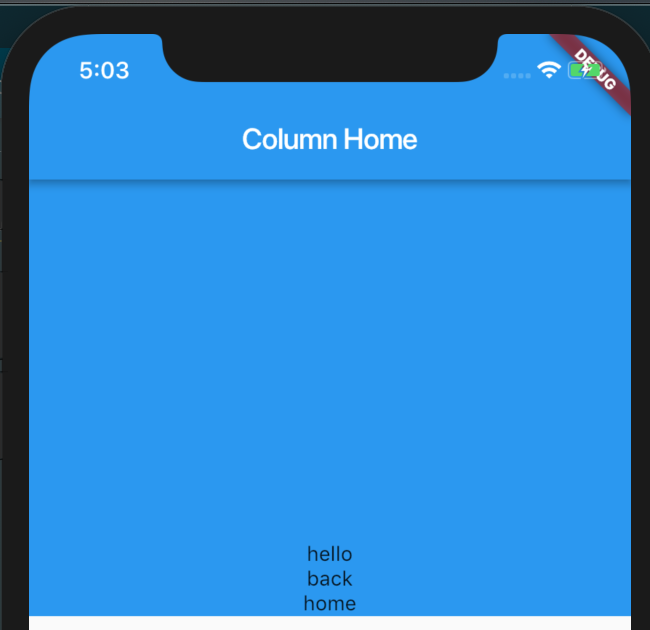
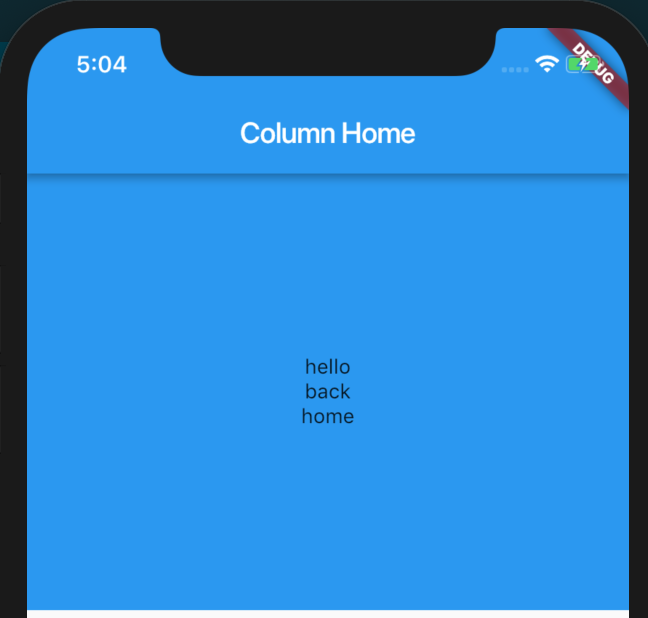
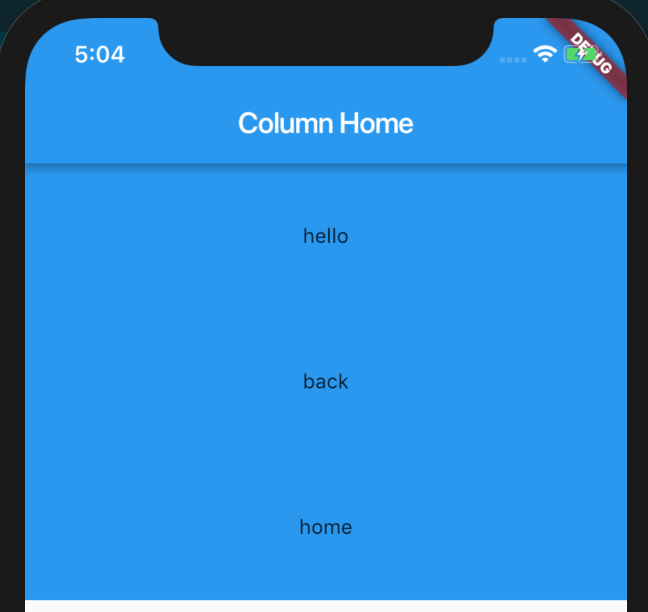
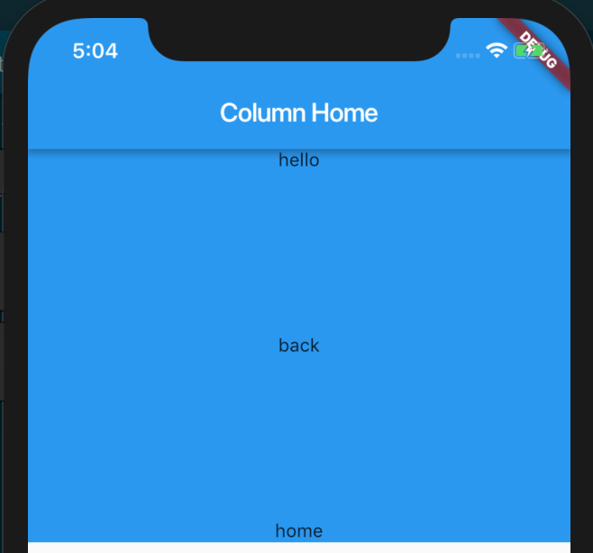

## Column

> A widget that displays its children in a vertical array.

Column 可以将 children Widget 向垂直的方向进行填充，它的布局行为继承于 Flex ，因此我们完全可以按照 Web 中的 Flex来参考，包括它的概念。

通过构造函数我们可以看到它的默认值：

```dart
Column({
  Key key,
  MainAxisAlignment mainAxisAlignment = MainAxisAlignment.start,
  MainAxisSize mainAxisSize = MainAxisSize.max,
  CrossAxisAlignment crossAxisAlignment = CrossAxisAlignment.center,
  TextDirection textDirection,
  VerticalDirection verticalDirection = VerticalDirection.down,
  TextBaseline textBaseline,
  List<Widget> children = const <Widget>[],
})
```

### crossAxisAlignment

它的作用可以让 children Widget 在交叉方向进行排列，它一共有五个属性，这里我只举例两个常用的属性，其他属性可参考 [https://docs.flutter.io/flutter/rendering/CrossAxisAlignment-class.html](https://docs.flutter.io/flutter/rendering/CrossAxisAlignment-class.html)。

**CrossAxisAlignment.end**




**CrossAxisAlignment.start**



### mainAxisAlignment

它的作用可以让 children Widget 在主轴方向进行排列，它一共有六个属性，这里我只举例四个常用的属性，其他属性可参考 [https://docs.flutter.io/flutter/rendering/MainAxisAlignment-class.html](https://docs.flutter.io/flutter/rendering/MainAxisAlignment-class.html)。

**MainAxisAlignment.end**



**MainAxisAlignment.center**



**MainAxisAlignment.spaceAround**

spaceAround 可以将 children Widget 之间空白的区域进行均分。



**MainAxisAlignment.spaceBetween**

spaceBetween 可以将 children Widget 之间的空白区域均等分隔，但是首尾两个元素都靠近边界的首尾。



其他属性可参考 [https://docs.flutter.io/flutter/widgets/Column-class.html](https://docs.flutter.io/flutter/widgets/Column-class.html)