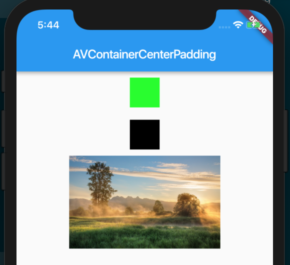
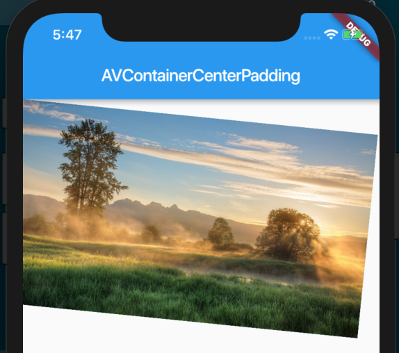

## Container

> A convenience widget that combines common painting, positioning, and sizing widgets.

[https://docs.flutter.io/flutter/widgets/Container-class.html](https://docs.flutter.io/flutter/widgets/Container-class.html)

做为一个使用频率非常高的 Widget 我们很有必要深入了解它的布局行为，如下 list 从官网翻译，很重要：

- Container 会遵循如下顺序去尝试布局
  - 对齐方式
  - 调整自身的尺寸来适应子节点
  - 采用高宽，约束
  - 调整自身去适应父节点
  - 调整自身到尽可能的小
- 如果没有子节点，没有高宽，没有约束，并且父 Widget 也没有设置 unbounded 约束，那么 Container 表现的行为会根据自身调整到尽可能的小。
- 如果没有子节点，没有设置对齐方式，但提供了高，宽，或约束，那么 Container 表现的行为会根据这些约束以及父 Widget 约束的组合，将自身调整到尽可能的小。
- 如果没有子节点，没有高宽，没有约束，没有对齐方式，但父 Widget 提供了 bounded constraints，那么 Container 表现的行为会根据父 Widget constraints 将自身调整到尽可能的大。
- 如果设置了对齐方式并且父 Widget 提供了 unbounded constraints ，那么 Container 表现的行为会调整自己的尺寸来包住子节点。
- 如果设置了对齐方式并且父 Widget 提供了bounded constraints，那么 Container 表现的行为会将自身调整为尽可能的大（在父 Widget 的范围内），然后将子节点根据对齐方式来调整。
- 如果有子节点，没有高宽，没有约束，没有对齐方式，那么 Container 表现的行为会将父 Widget 的约束传递给 子节点，并且子节点会根据这个约束进行调整
- margin，padding 也会影响布局

接下来让我们来看一看官网例子；

```dart
new Container(
  margin: const EdgeInsets.all(10.0),
  color: const Color(0xFF00FF00),
  width: 48.0,
  height: 48.0,
),
```


再让我们看一看一个组合的例子：

```dart
import 'package:flutter/material.dart';

class AVContainerCenterPadding extends StatelessWidget {
  @override
  Widget build(BuildContext context) {
    return new Scaffold(
      appBar: new AppBar(
        title: new Text('AVContainerCenterPadding'),
      ),
      body: new Column(
        children: <Widget>[
          new Container(
            margin: const EdgeInsets.all(10.0),
            color: const Color(0xFF00FF00),
            width: 48.0,
            height: 48.0,
          ),
          new Container(
            margin: const EdgeInsets.all(10.0),
            color: Colors.black,
            width: 48.0,
            height: 48.0,
          ),
          new Container(
            width: 640,
            height: 150.0,
            child: new Image.network('https://icepy.me/static/media/bg.3f44b417.jpg'),
          )
        ],
      ),
    );
  }
}
```



那么问题是“为什么它们是居中的”？因为 Column 的 crossAxisAlignment 默认值是 CrossAxisAlignment.center。

再让我们看一看官网提供的稍微复杂的例子：

```dart
import 'package:flutter/material.dart';

class AVContainerCenterPadding extends StatelessWidget {
  @override
  Widget build(BuildContext context) {
    return new Scaffold(
      appBar: new AppBar(
        title: new Text('AVContainerCenterPadding'),
      ),
      body: new Column(
        children: <Widget>[
          new Container(
            constraints: BoxConstraints.expand(
              height: Theme.of(context).textTheme.display1.fontSize * 1.1 + 200.0,
            ),
            padding: const EdgeInsets.all(8.0),
            color: Colors.teal.shade700,
            alignment: Alignment.center,
            child: Text('Hello World', style: Theme.of(context).textTheme.display1.copyWith(color: Colors.white)),
            foregroundDecoration: BoxDecoration(
              image: DecorationImage(
                image: NetworkImage('https://icepy.me/static/media/bg.3f44b417.jpg'),
                centerSlice: Rect.fromLTRB(270.0, 180.0, 1360.0, 730.0),
              ),
            ),
            transform: Matrix4.rotationZ(0.1),
          )
        ],
      ),
    );
  }
}
```



在这个例子中不仅用了 padding 还使用了对齐方式。

Container 提供的属性较多但每一个都很有用，如果有必要你可以阅读一下，从官网翻译而来：

- alignment：控制child的对齐方式
- padding：decoration内部的空白区域，如果有child的话，child位于padding内部。padding与margin的不同之处在于，padding是包含在content内，而margin则是外部边界，设置点击事件的话，padding区域会响应，而margin区域不会响应。
- color：用来设置container背景色，如果foregroundDecoration设置的话，可能会遮盖color效果。
- decoration：绘制在child后面的装饰，设置了decoration的话，就不能设置color属性。
- foregroundDecoration：绘制在child前面的装饰。
- width：container的宽度
- height：container的高度
- constraints：你可以使用 BoxConstraints 添加到child上额外的约束条件
- margin：围绕在decoration和child之外的空白区域。
- transform：设置container的变换矩阵，类型为Matrix4。
- child：container中的内容widget。