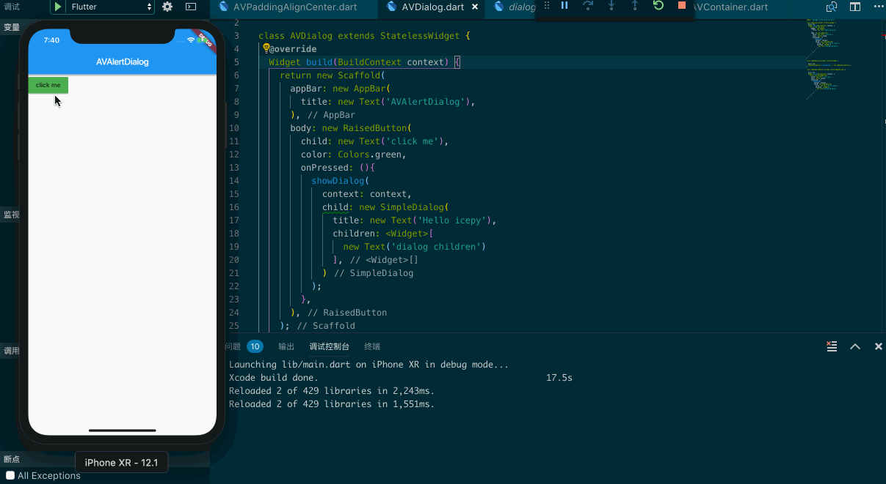
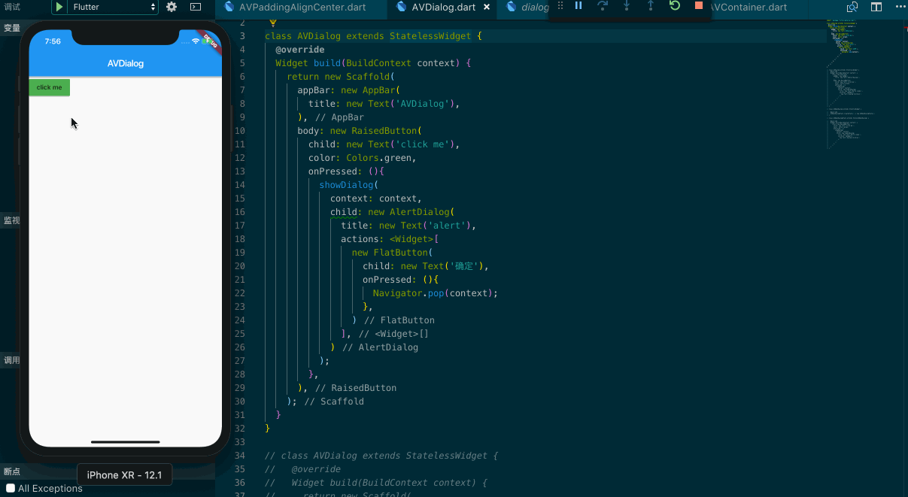
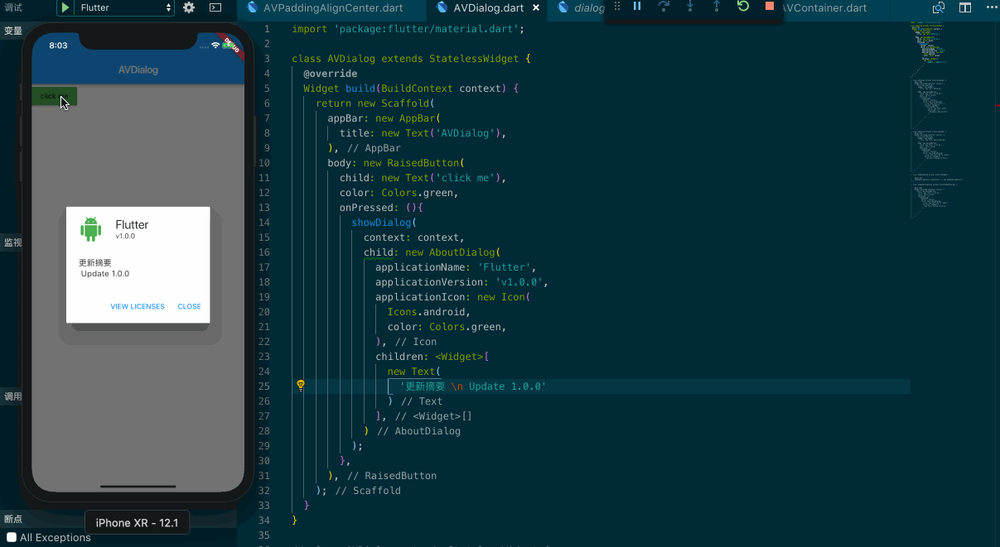

## SimpleDialog

> A simple material design dialog.

这是一种非常灵活的 Dialog 完全需要你根据自己的需求，来完成它的绘制。

```dart
import 'package:flutter/material.dart';

class AVDialog extends StatelessWidget {
  @override
  Widget build(BuildContext context) {
    return new Scaffold(
      appBar: new AppBar(
        title: new Text('AVAlertDialog'),
      ),
      body: new RaisedButton(
        child: new Text('click me'),
        color: Colors.green,
        onPressed: (){
          showDialog(
            context: context,
            child: new SimpleDialog(
              title: new Text('Hello icepy'),
              children: <Widget>[
                new Text('dialog children')
              ],
            )
          );
        },
      ),
    );
  }
}
```



## AlertDialog

> A material design alert dialog.

顾名思义这是一种比 SimpleDialog 封装程度更高的 Dialog ，一般情况下如果你的用户需要完成确认这一项功能，那么使用它会比较迅速。

```dart
import 'package:flutter/material.dart';

class AVDialog extends StatelessWidget {
  @override
  Widget build(BuildContext context) {
    return new Scaffold(
      appBar: new AppBar(
        title: new Text('AVDialog'),
      ),
      body: new RaisedButton(
        child: new Text('click me'),
        color: Colors.green,
        onPressed: (){
          showDialog(
            context: context,
            child: new AlertDialog(
              title: new Text('alert'),
              actions: <Widget>[
                new FlatButton(
                  child: new Text('确定'),
                  onPressed: (){
                    Navigator.pop(context);
                  },
                )
              ],
            )
          );
        },
      ),
    );
  }
}
```



## AboutDialog

> An about box. This is a dialog box with the application's icon, name, version number, and copyright, plus a button to show licenses for software used by the application.

这个 Widget 一般来说不是很常用，只用于显示应用，如图：



```dart
import 'package:flutter/material.dart';

class AVDialog extends StatelessWidget {
  @override
  Widget build(BuildContext context) {
    return new Scaffold(
      appBar: new AppBar(
        title: new Text('AVDialog'),
      ),
      body: new RaisedButton(
        child: new Text('click me'),
        color: Colors.green,
        onPressed: (){
          showDialog(
            context: context,
            child: new AboutDialog(
              applicationName: 'Flutter',
              applicationVersion: 'v1.0.0',
              applicationIcon: new Icon(
                Icons.android,
                color: Colors.green,
              ),
              children: <Widget>[
                new Text(
                  '更新摘要 \n Update 1.0.0'
                )
              ],
            )
          );
        },
      ),
    );
  }
}
```