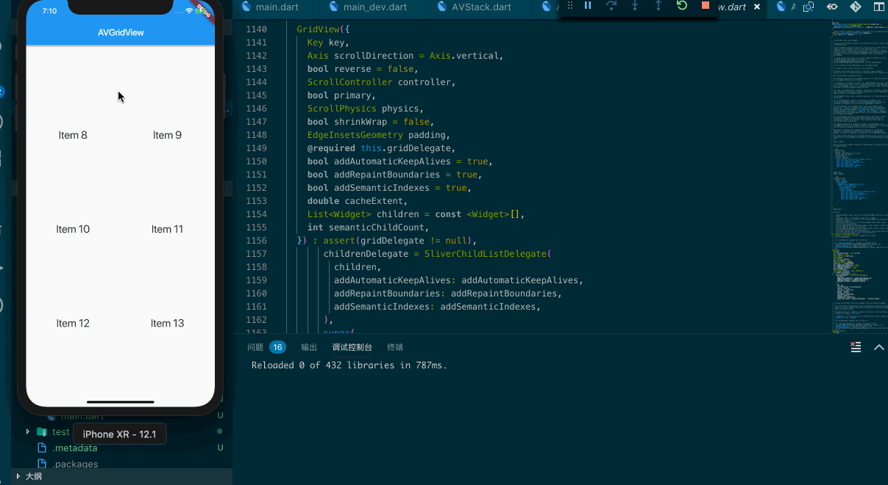

## GridView

> A scrollable, 2D array of widgets.

GridView 作为一个很常见的可滚动的多列列表，它的实际使用场景还是很多的。它的布局行为完全继承于 ScrollView，会尽量的占满整个空间，先让我们来看一个小例子：



```dart
import 'package:flutter/material.dart';

class AVGridView extends StatelessWidget {
  @override
  Widget build(BuildContext context){
    return new MaterialApp(
      home: new Scaffold(
        appBar: new AppBar(
          title: new Text('AVGridView'),
        ),
        body: new GridView.count(
          crossAxisCount: 2,
          children: List.generate(100, (index){
            return new Center(
              child: new Text(
                'Item ${index}',
                style: Theme.of(context).textTheme.headline,
              ),
            );
          })
        ),
      ),
    );
  }
}
```

在这个例子中创建了一个2列100个元素的列表，一般情况下我们会使用到它提供的四种方便的构造方法：

```bash
GridView.builder
GridView.custom
GridView.count
GridView.extent
```

接下来，我们看一看它的构造方法：

```dart
GridView({
  Key key,
  Axis scrollDirection = Axis.vertical,
  bool reverse = false,
  ScrollController controller,
  bool primary,
  ScrollPhysics physics,
  bool shrinkWrap = false,
  EdgeInsetsGeometry padding,
  @required this.gridDelegate,
  bool addAutomaticKeepAlives = true,
  bool addRepaintBoundaries = true,
  bool addSemanticIndexes = true,
  double cacheExtent,
  List<Widget> children = const <Widget>[],
  int semanticChildCount,
})
```

参数不是很多，这些属性都有它特定的意义，我们常用的如下：

- scrollDirection 设置滚动的方向
- controller 用于控制 child 滚动时的位置
- reverse 控制是否反向滚动
- physics 滚动视图如何响应用户的输入
- gridDelegate 控制GridView子 Widget 布局的  delegate

