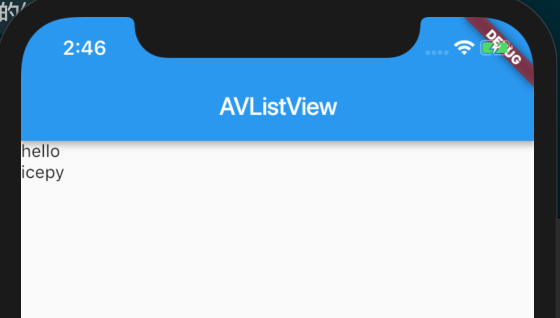
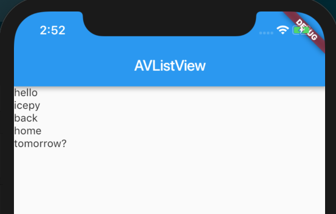
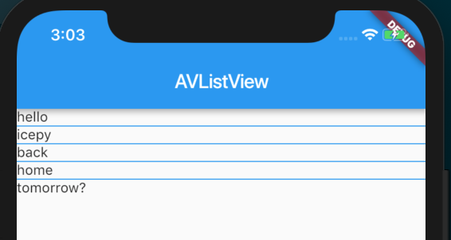
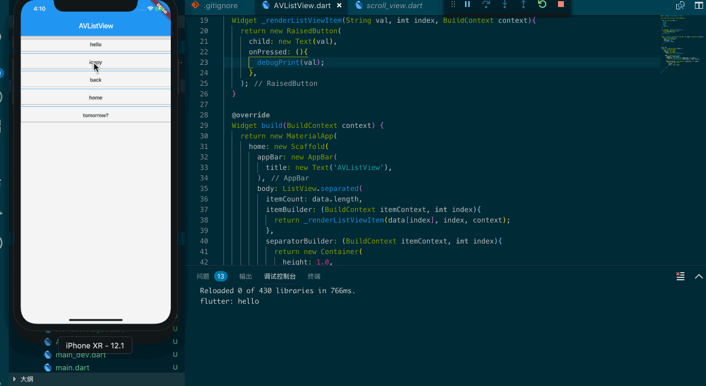

## ListView

> A scrollable list of widgets arranged linearly.

ListView 作为最常用的 Widget 并且根据你的父 Widget 的高宽自动处理滚动区域，不管是竖轴还是横轴，如果是横轴则需要填满 ListView。另外，这个 Widget 非常像 iOS 中的 UITableView ，需要说明的是如果你有大列表需要渲染，你应该优先使用 ListView 而不是自己开发。

先让我们来看一个列子，如图：



```dart
import 'package:flutter/material.dart';

class AVListView extends StatelessWidget {

  final List<String> data = ['hello', 'icepy'];

  List<Widget> _renderListViewItems(){
    return data.map<Widget>((v){
      return new Text(v);
    }).toList();
  }

  @override
  Widget build(BuildContext context) {
    return new MaterialApp(
      home: new Scaffold(
        appBar: new AppBar(
          title: new Text('AVListView'),
        ),
        body: new ListView(
          children: _renderListViewItems(),
        ),
      ),
    );
  }
}
```

当你使用 ListView 构造函数时它的子Item是根据你的数据多少来创建的，假如一次你给的数据超过10万条，那么此时 ListView 会一次性渲染出来10万条数据界面，这对于性能来说肯定不可接受，因此我们需要对上面的实现方式做一些更改。



```dart
import 'package:flutter/material.dart';

class AVListView extends StatelessWidget {

  final List<String> data = [
    'hello', 
    'icepy',
    'back',
    'home',
    'tomorrow?'
  ];

  Widget _renderListViewItem(String val){
    return new Text(val);
  }

  @override
  Widget build(BuildContext context) {
    return new MaterialApp(
      home: new Scaffold(
        appBar: new AppBar(
          title: new Text('AVListView'),
        ),
        body: ListView.builder(
          itemCount: data.length,
          itemBuilder: (BuildContext context, int index){
            return _renderListViewItem(data[index]);
          },
        )
      ),
    );
  }
}
```

另外你还可以使用 ListView.separated 和 ListView.custom ，其中 ListView.separated 的使用和 ListView.builder 很类似，唯一的区别在于 separated 可以绘制每一个 Item 的分隔符。



```dart
import 'package:flutter/material.dart';

class AVListView extends StatelessWidget {

  final List<String> data = [
    'hello', 
    'icepy',
    'back',
    'home',
    'tomorrow?'
  ];

  Widget _renderListViewItem(String val){
    return new Text(val);
  }

  @override
  Widget build(BuildContext context) {
    return new MaterialApp(
      home: new Scaffold(
        appBar: new AppBar(
          title: new Text('AVListView'),
        ),
        body: ListView.separated(
          itemCount: data.length,
          itemBuilder: (BuildContext context, int index){
            return _renderListViewItem(data[index]);
          },
          separatorBuilder: (BuildContext context, int index){
            return new Container(
              height: 1.0,
              color: Colors.blue,
            );
          },
        )
      )
    );
  }
}
```

至于 ListView.custom 顾名思义我们可以自定义，只不过需要传入一个实现了 SliverChildDelegate 的 Widget。

### SelectRowAt

虽然我们渲染了 ListView 但是多少情况下我们都需要完成一些操作，这些手势的事件在 ListView 里并没有一个很方便的方式，比如 iOS 的：

```Swift
func tableView(_ tableView: UITableView, didSelectRowAt indexPath: IndexPath) {

}
```

那么，我们只能使用另外的方式来处理这个问题了：

```dart
import 'package:flutter/material.dart';

class AVListView extends StatelessWidget {

  final List<String> data = [
    'hello', 
    'icepy',
    'back',
    'home',
    'tomorrow?'
  ];

  Widget _renderListViewItem(String val, int index, BuildContext context){
    return new RaisedButton(
      child: new Text(val),
      onPressed: (){
        debugPrint(val);
      },
    );
  }

  @override
  Widget build(BuildContext context) {
    return new MaterialApp(
      home: new Scaffold(
        appBar: new AppBar(
          title: new Text('AVListView'),
        ),
        body: ListView.separated(
          itemCount: data.length,
          itemBuilder: (BuildContext itemContext, int index){
            return _renderListViewItem(data[index], index, context);
          },
          separatorBuilder: (BuildContext itemContext, int index){
            return new Container(
              height: 1.0,
              color: Colors.blue,
            );
          },
        )
      )
    );
  }
}
```

