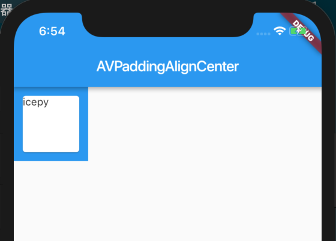
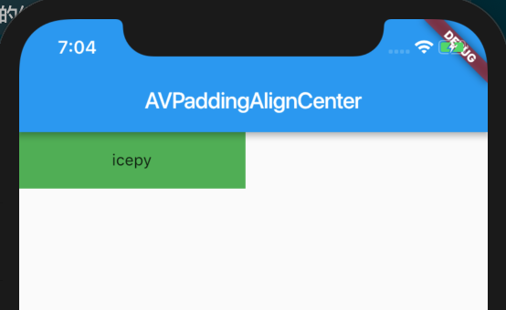
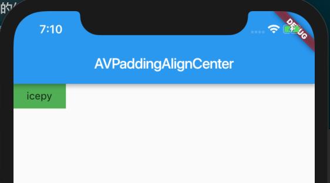

## Padding

> A widget that insets its child by the given padding.

Padding 作为一个基础 Widget 被使用的频率还是蛮高的，它的功能非常的单一，就是给子节点设置 padding 属性，你可以把它理解为前端的 css padding 属性。

```dart

import 'package:flutter/material.dart';

class AVPaddingAlignCenter extends StatelessWidget {
  @override
  Widget build(BuildContext context) {
    return new Scaffold(
      appBar: new AppBar(
        title: new Text('AVPaddingAlignCenter'),
      ),
      body: new Container(
        color: Colors.blue,
        width: 100.0,
        height: 100.0,
        child: new Padding(
          padding: EdgeInsets.all(8.0),
          child: new Card(
            child: new Text('icepy'),
          ),
        ),
      )
    );
  }
}

```

如图：



官网给出了一个小小的问题 **Why use a Padding widget rather than a Container with a Container.padding property?** ，翻译和整理如下：

Padding 和 Container padding 属性两者之间没有任何区别，如果你使用 Container padding 属性那么 Container 会为你构建一个 Padding，如果你只是想实现一个 padding 那么你应该使用 Padding 而不是 Container。Container 内部是将很多其他的 Widget 组合到了一起，如果考虑到性能和使用场景，你应该使用正确的 Widget 来实现 Padding。

## Align

> A widget that aligns its child within itself and optionally sizes itself based on the child's size.

Align 也是一个功能非常单一的 Widget 它只做一件事情，那就是设置 child 的对齐方式。

假设我们设置一个父 Widget 200.0 的容器，让我们来看一看它的效果：



```dart
import 'package:flutter/material.dart';

class AVPaddingAlignCenter extends StatelessWidget {
  @override
  Widget build(BuildContext context) {
    return new Scaffold(
      appBar: new AppBar(
        title: new Text('AVPaddingAlignCenter'),
      ),
      body: new Container(
        width: 200,
        height: 50,
        color: Colors.green,
        child: new Align(
          alignment: Alignment.center,
          child: new Text('icepy'),
        ),
      )
    );
  }
}
```

如果当你设置了widthFactor或heightFactor时，Align会根据factor属性来调整自身，比如当 widthFactor 是3的时候，Align 会将自身的width 调整为 child 的3倍。



```dart
import 'package:flutter/material.dart';

class AVPaddingAlignCenter extends StatelessWidget {
  @override
  Widget build(BuildContext context) {
    return new Scaffold(
      appBar: new AppBar(
        title: new Text('AVPaddingAlignCenter'),
      ),
      body: new Container(
        color: Colors.green,
        child: new Align(
          widthFactor: 2.0,
          heightFactor: 2.0,
          child: new Text('icepy'),
        ),
      )
    );
  }
}
```

## Center

> A widget that centers its child within itself.

顾名思义就是为了居中，通过源码我们可以看到：

```dart
class Center extends Align {
  /// Creates a widget that centers its child.
  const Center({ Key key, double widthFactor, double heightFactor, Widget child })
    : super(key: key, widthFactor: widthFactor, heightFactor: heightFactor, child: child);
}
```

它的布局行为和 Align 一致，只不过它只处理居中。