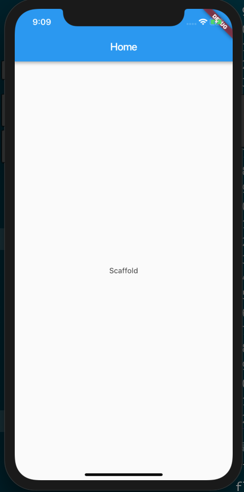
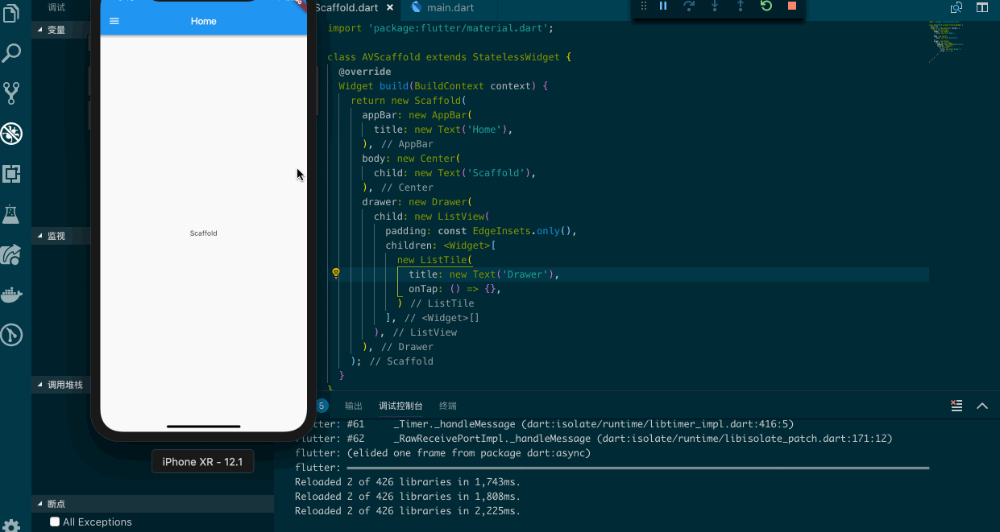
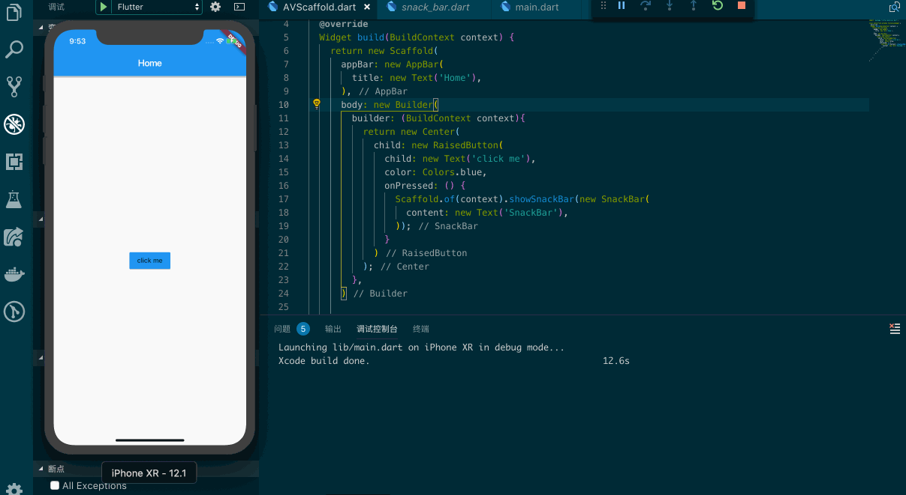
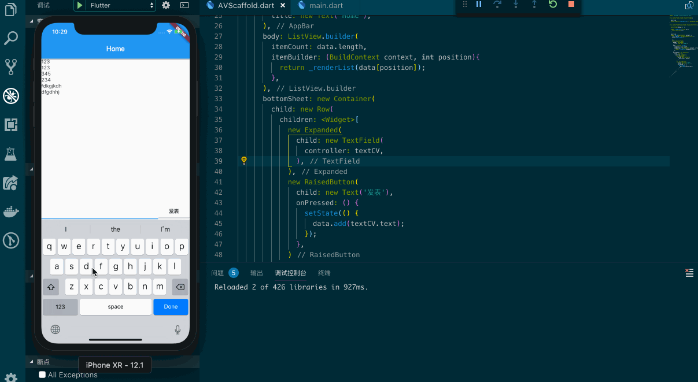

## Scaffold

> Implements the basic material design visual layout structure.

只要是在 Material 中定义的单个界面显示的 Widget 都可以使用它，它提供了诸如：抽屉（drawers）底部按钮（bottom sheets）和 底部通知（snack bars），你可以认为它是一基本快速实现某些布局的容器 Widget。

先让我们来看一个基础的带 AppBar 的布局框架：

```dart
import 'package:flutter/material.dart';

class AVScaffold extends StatelessWidget {
  @override
  Widget build(BuildContext context) {
    return new Scaffold(
      appBar: new AppBar(
        title: new Text('Home'),
      ),
      body: new Center(
        child: new Text('Scaffold'),
      ),
    );
  }
}
```



此外 Scaffold Widget 也能设置背景颜色等。

如果你想快速的实现一个 Drawer 布局框架，我们可以使用 drawer 属性，配合着 Drawer 和 ListView 来快速实现。

```dart
import 'package:flutter/material.dart';

class AVScaffold extends StatelessWidget {
  @override
  Widget build(BuildContext context) {
    return new Scaffold(
      appBar: new AppBar(
        title: new Text('Home'),
      ),
      body: new Center(
        child: new Text('Scaffold'),
      ),
      drawer: new Drawer(
        child: new ListView(
          padding: const EdgeInsets.only(),
          children: <Widget>[
            new ListTile(
              title: new Text('Drawer'),
              onTap: () => {},
            )
          ],
        ),
      ),
    );
  }
}
```



再让我们看一看 snack bars 的效果，实现起来也很简单，唯一需要注意的地方是如果你的 Scaffold 是被父 Widget 包裹的 Context，那么你需要引用 Scaffold 的 Context。



```dart
import 'package:flutter/material.dart';

class AVScaffold extends StatelessWidget {
  @override
  Widget build(BuildContext context) {
    return new Scaffold(
      appBar: new AppBar(
        title: new Text('Home'),
      ),
      body: new Builder(
        builder: (BuildContext context){
          return new Center(
            child: new RaisedButton(
              child: new Text('click me'),
              color: Colors.blue,
              onPressed: () {
                Scaffold.of(context).showSnackBar(new SnackBar(
                  content: new Text('SnackBar'),
                ));
              }
            )
          );
        },
      )
      
    );
  }
}
```

最后让我们来看一看 bottom sheets ，这个效果其实和前端里的 position: fixed 很类似，当你有一个输入框想输入一些文本时，为了让键盘不遮挡它，你可以使用 bottomSheet 快速实现一个这样的效果，为了能让例子更生动一些，我大概加了些别的 Widget，如图：



```dart
import 'package:flutter/material.dart';

class AVScaffold extends StatefulWidget{

  @override
  AVScaffoldState createState() => new AVScaffoldState();
}

class AVScaffoldState extends State<AVScaffold> {

  List<String> data = [''];

  Widget _renderList(String val){
    return new Text(val);
  }

  @override
  Widget build(BuildContext context) {
    final textCV = TextEditingController();
    textCV.addListener(() {
      
    });
    return new Scaffold(
      appBar: new AppBar(
        title: new Text('Home'),
      ),
      body: ListView.builder(
        itemCount: data.length,
        itemBuilder: (BuildContext context, int position){
          return _renderList(data[position]);
        },
      ),
      bottomSheet: new Container(
        child: new Row(
          children: <Widget>[
            new Expanded(
              child: new TextField(
                controller: textCV,
              ),
            ),
            new RaisedButton(
              child: new Text('发表'),
              onPressed: () {
                setState(() {
                  data.add(textCV.text);         
                });
              },
            )
          ],
        ),
      ),
    );
  }
}
```
