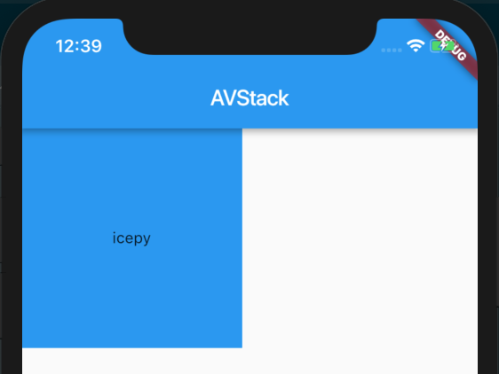
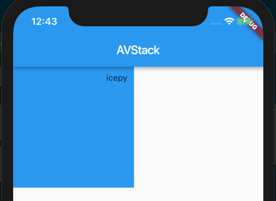
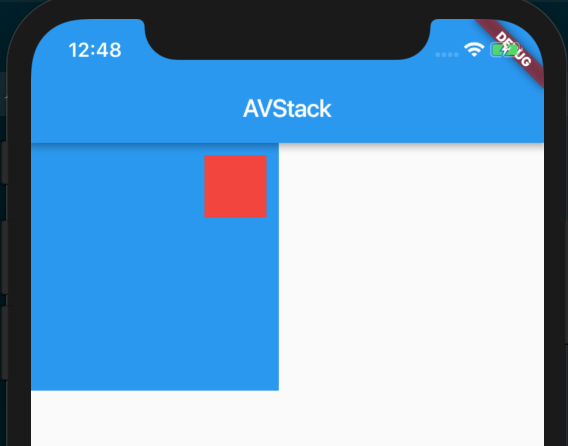

## Stack

> A widget that positions its children relative to the edges of its box.

Stack可以类比CSS中的absolute（绝对布局），一般情况这个 Widget 只会用于显示比如图片之上的一些信息。它的布局行为对于 child Widget 来说只分 positioned 还是 non-positioned ，处理方式不同。

- 如果是 positioned 的 child Widget 它的布局行为会根据设置的 top bottom right left 来确定
- 如果是 non-positioned 的 child Widget 它的布局行为会根据 Stack 的aligment 对齐方式来处理
- 对于 child Widget 的叠加处理是 List<Widget> 第一个 child Widget 在最下层，last child Widget 在最上层，位置的顺序非常类似 CSS 中的 z-index

先让我们看一看 non-positioned 的效果图：



```dart
import 'package:flutter/material.dart';

class AVStack extends StatelessWidget {
  @override
  Widget build(BuildContext context) {
    return new MaterialApp(
      home: new Scaffold(
        appBar: new AppBar(
          title: new Text('AVStack'),
        ),
        body: new Container(
          width: 200.0,
          height: 200.0,
          color: Colors.blue,
          child: new Stack(
            alignment: Alignment(0, 0),
            children: <Widget>[
              new Text(
                'icepy'
              ),
            ],
          ),
        )
      ),
    );
  }
}
```

然后我们再来看一看 positioned 的效果图：



```dart
import 'package:flutter/material.dart';

class AVStack extends StatelessWidget {
  @override
  Widget build(BuildContext context) {
    return new MaterialApp(
      home: new Scaffold(
        appBar: new AppBar(
          title: new Text('AVStack'),
        ),
        body: new Container(
          width: 200.0,
          height: 200.0,
          color: Colors.blue,
          child: new Stack(
            children: <Widget>[
              new Positioned(
                top: 10.0,
                right: 10.0,
                child: new Text(
                  'icepy'
                ),
              )
            ],
          ),
        )
      ),
    );
  }
}
```

## IndexedStack

> A Stack that shows a single child from a list of children.

这个 Widget 的作用和 Stack 非常类似，唯一的区别是如果你有三个 child Widget，那么它的布局行为是显示你指定的第index个 child Widget ，其他 child Widget 不可见。



```dart
import 'package:flutter/material.dart';

class AVStack extends StatelessWidget {
  @override
  Widget build(BuildContext context) {
    return new MaterialApp(
      home: new Scaffold(
        appBar: new AppBar(
          title: new Text('AVStack'),
        ),
        body: new Container(
          width: 200.0,
          height: 200.0,
          color: Colors.blue,
          child: new IndexedStack(
            index: 1,
            children: <Widget>[
              new Container(
                width: 20.0,
                height: 20.0,
                color: Colors.grey,
              ),
              new Positioned(
                top: 10.0,
                right: 10.0,
                child: new Container(
                  width: 50.0,
                  height: 50.0,
                  color: Colors.red,
                ),
              )
            ],
          ),
        )
      ),
    );
  }
}
```